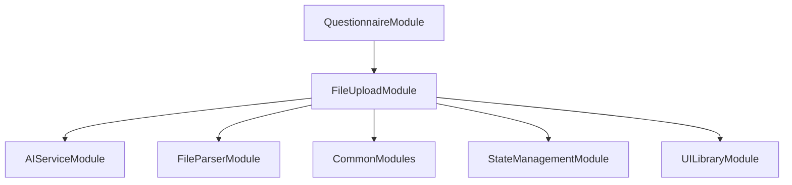

# FE-M001: FileUploadModule 상세 개발 설계서

## 1. 모듈 개요

### 1.1 모듈 식별 정보
- **모듈 ID**: FE-M001
- **모듈명**: FileUploadModule (파일 업로드 및 AI 분석)
- **담당 개발자**: 프론트엔드 개발자 (React/TypeScript 전문)
- **예상 개발 기간**: 5일
- **우선순위**: P0 (필수)

### 1.2 모듈 목적 및 범위
- **핵심 기능**: 
  1. 드래그&드롭 파일 업로드
  2. 다중 파일 형식 지원 (Excel, Word, PDF, 이미지, 텍스트)
  3. AI 기반 문서 분석 및 결과 시각화
  4. 분석 결과 탭별 표시 (요약, 상세, 추천 질문, 연관 요구사항)
  5. 프로젝트 전체 요약 생성
- **비즈니스 가치**: SI 프로젝트의 첫 번째 단계로, 자유형식 요구사항 문서를 AI로 자동 분석하여 구조화된 정보를 제공
- **제외 범위**: 파일 저장소 관리, 사용자 인증, 다른 단계와의 데이터 연동

### 1.3 목표 사용자
- **주 사용자 그룹**: SI 프로젝트 매니저, 시스템 분석가
- **사용자 페르소나**: 경험 5년 이상의 SI 프로젝트 매니저, 다양한 형식의 요구사항 문서를 보유
- **사용 시나리오**: 신규 SI 프로젝트 시작 시 기존 요구사항 문서들을 업로드하고 AI 분석을 통해 체계적인 정보 추출

---

## 2. 기술 아키텍처

### 2.1 모듈 구조
```
FileUploadModule/
├── components/
│   ├── FileUploadArea.tsx      # 드래그&드롭 업로드 영역
│   ├── FileList.tsx            # 업로드된 파일 목록
│   ├── AnalysisResults.tsx     # 분석 결과 탭 컨테이너
│   ├── ProjectSummary.tsx      # 프로젝트 전체 요약
│   └── FileItem.tsx            # 개별 파일 아이템
├── hooks/
│   ├── useFileUpload.ts        # 파일 업로드 로직
│   ├── useFileAnalysis.ts      # AI 분석 로직
│   └── useProjectSummary.ts    # 프로젝트 요약 로직
├── services/
│   ├── fileUploadService.ts    # 파일 업로드 서비스
│   └── analysisService.ts      # 분석 서비스
├── types/
│   ├── fileTypes.ts            # 파일 관련 타입 정의
│   └── analysisTypes.ts        # 분석 결과 타입 정의
├── utils/
│   ├── fileValidation.ts       # 파일 유효성 검증
│   ├── formatFileSize.ts       # 파일 크기 포맷팅
│   └── downloadUtils.ts        # 다운로드 유틸리티
├── tests/
│   ├── FileUpload.test.tsx
│   ├── FileAnalysis.test.tsx
│   └── ProjectSummary.test.tsx
└── index.ts                    # 모듈 진입점
```

### 2.2 기술 스택
- **프레임워크**: React 18 + TypeScript
- **상태관리**: Zustand (전역 상태) + React Hook (로컬 상태)
- **스타일링**: Tailwind CSS + Shadcn/ui
- **테스트**: Jest + Testing Library
- **파일 처리**: FileReader API + 브라우저 호환 라이브러리

---

## 3. 인터페이스 정의

### 3.1 외부 의존성
```typescript
interface ExternalDependencies {
  modules: [
    'SH-M001: AIServiceModule',    // AI 분석 서비스
    'SH-M002: FileParserModule',   // 파일 파싱 유틸리티
    'FE-M008: CommonModules'       // 공통 UI 컴포넌트
  ];
  apis: [
    '/api/files/upload',           // 파일 업로드 API
    '/api/files/analyze',          // AI 분석 API
    '/api/projects/summary'        // 프로젝트 요약 API
  ];
  sharedComponents: [
    'Button', 'Card', 'Tabs', 'Progress', 'Alert', 'Badge'
  ];
  utils: [
    'formatFileSize', 'validateFile', 'downloadFile'
  ];
}
```

### 3.2 제공 인터페이스
```typescript
export interface FileUploadModuleInterface {
  components: {
    FileUploadModule: React.FC<FileUploadModuleProps>;
    FileUploadArea: React.FC<FileUploadAreaProps>;
    FileList: React.FC<FileListProps>;
    AnalysisResults: React.FC<AnalysisResultsProps>;
    ProjectSummary: React.FC<ProjectSummaryProps>;
  };
  
  hooks: {
    useFileUpload: () => FileUploadHook;
    useFileAnalysis: () => FileAnalysisHook;
    useProjectSummary: () => ProjectSummaryHook;
  };
  
  services: {
    FileUploadService: FileUploadServiceClass;
    AnalysisService: AnalysisServiceClass;
  };
  
  types: {
    FileItem: FileItemType;
    AnalysisResult: AnalysisResultType;
    ProjectSummary: ProjectSummaryType;
  };
}
```

### 3.3 API 명세
```typescript
interface FileUploadAPIEndpoints {
  POST: {
    '/api/files/upload': {
      request: {
        files: File[];
        projectId: string;
      };
      response: {
        success: boolean;
        files: FileItem[];
        errors?: string[];
      };
      errors: ['FILE_TOO_LARGE', 'INVALID_FORMAT', 'UPLOAD_FAILED'];
    };
  };
  
  POST: {
    '/api/files/analyze': {
      request: {
        fileIds: string[];
        projectId: string;
      };
      response: {
        success: boolean;
        results: AnalysisResult[];
        summary: ProjectSummary;
      };
      errors: ['ANALYSIS_FAILED', 'AI_SERVICE_ERROR', 'FILE_NOT_FOUND'];
    };
  };
}
```

---

## 4. 데이터 모델

### 4.1 엔티티 정의
```typescript
interface FileItem {
  id: string;
  name: string;
  size: number;
  type: string;
  progress: number;
  status: 'uploading' | 'completed' | 'analyzing' | 'analyzed' | 'error';
  analysis?: AnalysisResult;
  parsedContent?: {
    text: string;
    metadata?: any;
  };
  error?: string;
  uploadedAt: Date;
  analyzedAt?: Date;
}

interface AnalysisResult {
  summary: string;
  keyPoints: string[];
  documentType: string;
  confidence: number;
  suggestedQuestions: string[];
  relatedRequirements: string[];
  businessContext: string;
  technicalRequirements: string[];
  userStories: string[];
}

interface ProjectSummary {
  totalFiles: number;
  analyzedFiles: number;
  overallSummary: string;
  keyInsights: string[];
  recommendedNextSteps: string[];
  estimatedComplexity: 'Low' | 'Medium' | 'High';
  suggestedTechnologies: string[];
}
```

### 4.2 DTO 정의
```typescript
class FileUploadRequestDTO {
  @IsArray()
  @ValidateNested({ each: true })
  files: File[];

  @IsString()
  @IsNotEmpty()
  projectId: string;
}

class AnalysisRequestDTO {
  @IsArray()
  @IsString({ each: true })
  fileIds: string[];

  @IsString()
  @IsNotEmpty()
  projectId: string;
}

class AnalysisResponseDTO {
  success: boolean;
  results: AnalysisResult[];
  summary: ProjectSummary;
  errors?: string[];
}
```

### 4.3 상태 관리 스키마
```typescript
interface FileUploadState {
  files: FileItem[];
  isUploading: boolean;
  isAnalyzing: boolean;
  analysisComplete: boolean;
  projectSummary: ProjectSummary | null;
  error: string | null;
  
  actions: {
    uploadFiles: (files: File[]) => Promise<void>;
    removeFile: (fileId: string) => void;
    startAnalysis: () => Promise<void>;
    downloadAnalysisResults: () => void;
    clearError: () => void;
    resetModule: () => void;
  };
}
```

---

## 5. 핵심 컴포넌트/서비스 명세

### 5.1 주요 컴포넌트 (Frontend)
```typescript
interface FileUploadAreaProps {
  onFilesSelected: (files: File[]) => void;
  isUploading: boolean;
  acceptedTypes: string[];
  maxFileSize: number;
  maxFiles: number;
}

const FileUploadArea: React.FC<FileUploadAreaProps> = ({
  onFilesSelected,
  isUploading,
  acceptedTypes,
  maxFileSize,
  maxFiles
}) => {
  // 드래그&드롭 이벤트 핸들링
  // 파일 유효성 검증
  // 진행률 표시
  // 에러 상태 처리
};

interface FileListProps {
  files: FileItem[];
  onRemoveFile: (fileId: string) => void;
  onRetryUpload: (fileId: string) => void;
  isAnalyzing: boolean;
}

const FileList: React.FC<FileListProps> = ({
  files,
  onRemoveFile,
  onRetryUpload,
  isAnalyzing
}) => {
  // 파일 목록 렌더링
  // 상태별 아이콘 및 진행률 표시
  // 액션 버튼 (삭제, 재시도)
};

interface AnalysisResultsProps {
  files: FileItem[];
  projectSummary: ProjectSummary | null;
  isAnalyzing: boolean;
  onDownloadResults: () => void;
}

const AnalysisResults: React.FC<AnalysisResultsProps> = ({
  files,
  projectSummary,
  isAnalyzing,
  onDownloadResults
}) => {
  // 탭 기반 분석 결과 표시
  // 개별 파일 분석 결과
  // 프로젝트 전체 요약
  // 다운로드 기능
};
```

### 5.2 주요 서비스 (Backend)
```typescript
@Injectable()
export class FileUploadService {
  constructor(
    private readonly httpClient: HttpClient,
    private readonly fileParser: FileParserService
  ) {}
  
  async uploadFiles(files: File[], projectId: string): Promise<FileItem[]> {
    // 파일 업로드 처리
    // 진행률 추적
    // 에러 핸들링
    // 파일 파싱 시작
  }
  
  async validateFile(file: File): Promise<ValidationResult> {
    // 파일 크기 검증
    // 파일 형식 검증
    // 보안 검사
  }
  
  async parseFile(file: File): Promise<ParsedContent> {
    // 파일 형식별 파싱
    // 텍스트 추출
    // 메타데이터 수집
  }
}

@Injectable()
export class AnalysisService {
  constructor(
    private readonly aiService: AIService,
    private readonly fileParser: FileParserService
  ) {}
  
  async analyzeFiles(files: FileItem[]): Promise<AnalysisResult[]> {
    // 파일별 AI 분석
    // 신뢰도 계산
    // 결과 구조화
  }
  
  async generateProjectSummary(analysisResults: AnalysisResult[]): Promise<ProjectSummary> {
    // 전체 프로젝트 요약 생성
    // 핵심 인사이트 추출
    // 다음 단계 추천
  }
  
  async downloadAnalysisResults(projectId: string): Promise<Blob> {
    // 분석 결과 다운로드
    // Excel/PDF 형식 지원
  }
}
```

---

## 6. 이벤트 및 메시징

### 6.1 발행 이벤트
```typescript
enum FileUploadEvents {
  FILES_UPLOADED = 'fileupload.files.uploaded',
  ANALYSIS_STARTED = 'fileupload.analysis.started',
  ANALYSIS_COMPLETED = 'fileupload.analysis.completed',
  ANALYSIS_FAILED = 'fileupload.analysis.failed',
  PROJECT_SUMMARY_GENERATED = 'fileupload.project.summary.generated',
  MODULE_COMPLETED = 'fileupload.module.completed'
}

interface FileUploadEventPayload {
  eventType: FileUploadEvents;
  data: {
    projectId: string;
    files?: FileItem[];
    analysisResults?: AnalysisResult[];
    projectSummary?: ProjectSummary;
    error?: string;
  };
  timestamp: Date;
}
```

### 6.2 구독 이벤트
```typescript
interface SubscribedEvents {
  'project.created': (payload: ProjectCreatedPayload) => void;
  'project.deleted': (payload: ProjectDeletedPayload) => void;
  'user.logout': (payload: UserLogoutPayload) => void;
}
```

---

## 7. 에러 처리

### 7.1 에러 코드 정의
```typescript
enum FileUploadErrorCode {
  FILE_TOO_LARGE = 'FE_M001_001',
  INVALID_FILE_FORMAT = 'FE_M001_002',
  UPLOAD_FAILED = 'FE_M001_003',
  ANALYSIS_FAILED = 'FE_M001_004',
  AI_SERVICE_ERROR = 'FE_M001_005',
  FILE_NOT_FOUND = 'FE_M001_006',
  NETWORK_ERROR = 'FE_M001_007',
  VALIDATION_ERROR = 'FE_M001_008'
}
```

### 7.2 에러 처리 전략
- **Frontend**: ErrorBoundary 구현, 사용자 친화적 메시지 표시, 재시도 옵션 제공
- **Backend**: 구조화된 에러 응답, 로깅 및 모니터링, 폴백 분석 제공

---

## 8. 테스트 전략

### 8.1 단위 테스트
```typescript
describe('FileUploadModule', () => {
  describe('FileUploadArea', () => {
    it('should handle drag and drop correctly', () => {
      // 드래그&드롭 테스트
    });
    
    it('should validate file types and sizes', () => {
      // 파일 유효성 검증 테스트
    });
    
    it('should show upload progress', () => {
      // 진행률 표시 테스트
    });
  });
  
  describe('FileAnalysis', () => {
    it('should analyze files successfully', async () => {
      // AI 분석 테스트
    });
    
    it('should handle analysis errors gracefully', async () => {
      // 에러 처리 테스트
    });
  });
  
  describe('ProjectSummary', () => {
    it('should generate comprehensive summary', async () => {
      // 프로젝트 요약 생성 테스트
    });
  });
});
```

### 8.2 통합 테스트
- **API 테스트**: 파일 업로드 및 분석 API 통합 테스트
- **E2E 테스트**: 전체 파일 업로드 → 분석 → 결과 표시 플로우
- **목업 데이터**: 다양한 파일 형식별 테스트 데이터

### 8.3 테스트 커버리지 목표
- **단위 테스트**: 85% 이상
- **통합 테스트**: 핵심 플로우 100%

---

## 9. 성능 최적화

### 9.1 캐싱 전략
- **파일 캐싱**: 업로드된 파일 메모리 캐싱
- **분석 결과 캐싱**: AI 분석 결과 로컬 스토리지 캐싱
- **프로젝트 요약 캐싱**: 프로젝트별 요약 결과 캐싱

### 9.2 최적화 기법
- **코드 스플리팅**: 파일 업로드 관련 컴포넌트 동적 로딩
- **이미지 최적화**: 이미지 파일 압축 및 썸네일 생성
- **청크 업로드**: 대용량 파일 청크 단위 업로드

---

## 10. 보안 고려사항

### 10.1 인증/인가
- **JWT 검증**: 모든 API 호출 시 토큰 검증
- **프로젝트 권한**: 프로젝트별 파일 접근 권한 체크
- **파일 검증**: 업로드 파일 보안 스캔

### 10.2 데이터 보호
- **민감 정보**: 분석 결과 중 민감 정보 마스킹
- **XSS 방지**: 사용자 입력 데이터 삭제화
- **CSRF 보호**: 업로드 요청 시 CSRF 토큰 검증

---

## 11. 배포 및 모니터링

### 11.1 Docker 설정
```dockerfile
# Frontend 모듈은 메인 앱과 함께 빌드
FROM node:20-alpine
WORKDIR /app
COPY package*.json ./
RUN npm ci --only=production
COPY . .
RUN npm run build
```

### 11.2 환경 변수
```env
# 파일 업로드 관련 설정
VITE_MAX_FILE_SIZE_MB=100
VITE_MAX_FILES_COUNT=50
VITE_SUPPORTED_FILE_TYPES=pdf,doc,docx,xls,xlsx,ppt,pptx,txt,jpg,png

# AI 분석 설정
VITE_OPENAI_API_KEY=your_api_key_here
VITE_AI_MODEL=gpt-4o-mini
VITE_ANALYSIS_TIMEOUT=30000
```

### 11.3 로깅 및 모니터링
- **로그 레벨**: Debug/Info/Warn/Error
- **메트릭**: 업로드 성공률, 분석 성공률, 평균 응답 시간
- **알림**: 분석 실패, 대용량 파일 업로드, 에러율 임계치 초과

---

## 12. 개발 가이드라인

### 12.1 코딩 컨벤션
- **네이밍**: camelCase (변수), PascalCase (컴포넌트/클래스)
- **파일 구조**: 기능별 그룹핑, 명확한 import/export
- **주석**: JSDoc 형식, 복잡한 로직 설명

### 12.2 Git 브랜치 전략
```
main
├── develop
│   ├── feature/FE-M001-file-upload
│   ├── feature/FE-M001-analysis-results
│   └── fix/FE-M001-upload-error-handling
```

### 12.3 PR 체크리스트
- [ ] 단위 테스트 통과
- [ ] 코드 리뷰 승인
- [ ] 파일 업로드 시나리오 테스트
- [ ] AI 분석 플로우 테스트
- [ ] 에러 처리 시나리오 테스트
- [ ] 성능 영향 검토

---

## 13. 의존성 그래프



---

이 설계서는 FileUploadModule의 독립적인 개발을 위한 완전한 가이드를 제공하며, 다른 모듈과의 최소한의 의존성을 유지하면서 명확한 인터페이스를 통해 통신하도록 설계되었습니다.
