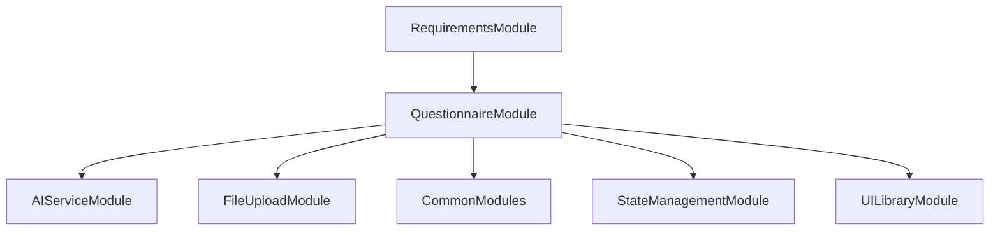

# FE-M002: QuestionnaireModule 상세 개발 설계서

## 1. 모듈 개요

### 1.1 모듈 식별 정보
- **모듈 ID**: FE-M002
- **모듈명**: QuestionnaireModule (질의서 생성 및 편집)
- **담당 개발자**: 프론트엔드 개발자 (React/TypeScript 전문)
- **예상 개발 기간**: 4일
- **우선순위**: P0 (필수)

### 1.2 모듈 목적 및 범위
- **핵심 기능**: 
  1. AI 기반 질문 자동 생성
  2. 카테고리별 질문 분류 (필수/선택/권장)
  3. 실시간 편집 및 자동 저장
  4. 완성도 검증 및 진행률 표시
  5. Excel 다운로드 기능
- **비즈니스 가치**: 파일 분석 결과를 바탕으로 누락된 정보를 파악하고, 업계 표준 질문을 자동 생성하여 체계적인 요구사항 수집 지원
- **제외 범위**: 질문 답변 수집, 다른 단계와의 직접적 데이터 연동, 사용자 인증

### 1.3 목표 사용자
- **주 사용자 그룹**: 시스템 분석가, 프로젝트 매니저
- **사용자 페르소나**: 요구사항 분석 경험 3년 이상, 체계적인 질문 설계 능력 보유
- **사용 시나리오**: 파일 분석 완료 후 누락된 정보를 파악하고, 체계적인 질의서를 통해 완전한 요구사항 수집

---

## 2. 기술 아키텍처

### 2.1 모듈 구조
```
QuestionnaireModule/
├── components/
│   ├── QuestionnaireEditor.tsx    # 메인 질의서 에디터
│   ├── QuestionList.tsx           # 질문 목록 컴포넌트
│   ├── QuestionItem.tsx           # 개별 질문 아이템
│   ├── QuestionEditor.tsx         # 질문 편집 패널
│   ├── CategoryFilter.tsx         # 카테고리 필터
│   ├── ProgressIndicator.tsx      # 진행률 표시기
│   └── ValidationPanel.tsx        # 검증 결과 패널
├── hooks/
│   ├── useQuestionnaire.ts        # 질의서 상태 관리
│   ├── useQuestionEditor.ts       # 질문 편집 로직
│   ├── useAutoSave.ts             # 자동 저장 로직
│   └── useValidation.ts           # 검증 로직
├── services/
│   ├── questionGenerationService.ts # AI 질문 생성 서비스
│   ├── questionnaireService.ts     # 질의서 관리 서비스
│   └── exportService.ts            # 내보내기 서비스
├── types/
│   ├── questionTypes.ts           # 질문 관련 타입 정의
│   ├── questionnaireTypes.ts      # 질의서 관련 타입 정의
│   └── validationTypes.ts         # 검증 관련 타입 정의
├── utils/
│   ├── questionValidation.ts      # 질문 유효성 검증
│   ├── exportUtils.ts             # 내보내기 유틸리티
│   └── debounceUtils.ts           # 디바운싱 유틸리티
├── templates/
│   ├── questionTemplates.ts       # 질문 템플릿
│   └── categoryTemplates.ts       # 카테고리 템플릿
├── tests/
│   ├── QuestionnaireEditor.test.tsx
│   ├── QuestionGeneration.test.tsx
│   └── Validation.test.tsx
└── index.ts                       # 모듈 진입점
```

### 2.2 기술 스택
- **프레임워크**: React 18 + TypeScript
- **상태관리**: Zustand (전역 상태) + React Hook (로컬 상태)
- **스타일링**: Tailwind CSS + Shadcn/ui
- **에디터**: React Hook Form + Zod validation
- **테스트**: Jest + Testing Library

---

## 3. 인터페이스 정의

### 3.1 외부 의존성
```typescript
interface ExternalDependencies {
  modules: [
    'SH-M001: AIServiceModule',    // AI 질문 생성 서비스
    'FE-M001: FileUploadModule',   // 파일 분석 결과
    'FE-M008: CommonModules'       // 공통 UI 컴포넌트
  ];
  apis: [
    '/api/questions/generate',     // AI 질문 생성 API
    '/api/questionnaire/save',     // 질의서 저장 API
    '/api/questionnaire/export'    // 질의서 내보내기 API
  ];
  sharedComponents: [
    'Button', 'Input', 'Textarea', 'Select', 'Checkbox', 'Card', 'Tabs', 'Progress'
  ];
  utils: [
    'debounce', 'validateEmail', 'formatDate'
  ];
}
```

### 3.2 제공 인터페이스
```typescript
export interface QuestionnaireModuleInterface {
  components: {
    QuestionnaireModule: React.FC<QuestionnaireModuleProps>;
    QuestionnaireEditor: React.FC<QuestionnaireEditorProps>;
    QuestionList: React.FC<QuestionListProps>;
    QuestionEditor: React.FC<QuestionEditorProps>;
    ProgressIndicator: React.FC<ProgressIndicatorProps>;
  };
  
  hooks: {
    useQuestionnaire: () => QuestionnaireHook;
    useQuestionEditor: () => QuestionEditorHook;
    useAutoSave: () => AutoSaveHook;
    useValidation: () => ValidationHook;
  };
  
  services: {
    QuestionGenerationService: QuestionGenerationServiceClass;
    QuestionnaireService: QuestionnaireServiceClass;
    ExportService: ExportServiceClass;
  };
  
  types: {
    Question: QuestionType;
    Questionnaire: QuestionnaireType;
    QuestionCategory: QuestionCategoryType;
  };
}
```

### 3.3 API 명세
```typescript
interface QuestionnaireAPIEndpoints {
  POST: {
    '/api/questions/generate': {
      request: {
        analysisResults: AnalysisResult[];
        projectType: string;
        customPrompts?: string[];
      };
      response: {
        success: boolean;
        questions: Question[];
        categories: QuestionCategory[];
      };
      errors: ['GENERATION_FAILED', 'AI_SERVICE_ERROR', 'INVALID_INPUT'];
    };
  };
  
  PUT: {
    '/api/questionnaire/save': {
      request: {
        projectId: string;
        questionnaire: Questionnaire;
      };
      response: {
        success: boolean;
        savedAt: Date;
      };
      errors: ['SAVE_FAILED', 'VALIDATION_ERROR', 'PROJECT_NOT_FOUND'];
    };
  };
  
  GET: {
    '/api/questionnaire/export': {
      request: {
        projectId: string;
        format: 'excel' | 'pdf' | 'json';
      };
      response: Blob;
      errors: ['EXPORT_FAILED', 'FORMAT_NOT_SUPPORTED'];
    };
  };
}
```

---

## 4. 데이터 모델

### 4.1 엔티티 정의
```typescript
interface Question {
  id: string;
  text: string;
  category: QuestionCategory;
  priority: 'required' | 'optional' | 'recommended';
  type: 'text' | 'textarea' | 'select' | 'checkbox' | 'radio';
  options?: string[];
  placeholder?: string;
  validationRules?: ValidationRule[];
  isGenerated: boolean;
  isEdited: boolean;
  order: number;
  createdAt: Date;
  updatedAt: Date;
}

interface QuestionCategory {
  id: string;
  name: string;
  description: string;
  color: string;
  icon: string;
  order: number;
}

interface Questionnaire {
  id: string;
  projectId: string;
  title: string;
  description: string;
  questions: Question[];
  categories: QuestionCategory[];
  completionRate: number;
  validationStatus: ValidationStatus;
  createdAt: Date;
  updatedAt: Date;
  lastSavedAt: Date;
}

interface ValidationRule {
  type: 'required' | 'minLength' | 'maxLength' | 'pattern' | 'custom';
  value?: any;
  message: string;
}

interface ValidationStatus {
  isValid: boolean;
  errors: ValidationError[];
  warnings: ValidationWarning[];
  completionRate: number;
}
```

### 4.2 DTO 정의
```typescript
class QuestionGenerationRequestDTO {
  @IsArray()
  @ValidateNested({ each: true })
  analysisResults: AnalysisResult[];

  @IsString()
  @IsNotEmpty()
  projectType: string;

  @IsOptional()
  @IsArray()
  @IsString({ each: true })
  customPrompts?: string[];
}

class QuestionnaireSaveRequestDTO {
  @IsString()
  @IsNotEmpty()
  projectId: string;

  @ValidateNested()
  questionnaire: Questionnaire;
}

class QuestionnaireExportRequestDTO {
  @IsString()
  @IsNotEmpty()
  projectId: string;

  @IsEnum(['excel', 'pdf', 'json'])
  format: 'excel' | 'pdf' | 'json';
}
```

### 4.3 상태 관리 스키마
```typescript
interface QuestionnaireState {
  questionnaire: Questionnaire | null;
  isGenerating: boolean;
  isSaving: boolean;
  isExporting: boolean;
  validationStatus: ValidationStatus;
  autoSaveStatus: 'idle' | 'saving' | 'saved' | 'error';
  lastSavedAt: Date | null;
  
  actions: {
    generateQuestions: (analysisResults: AnalysisResult[]) => Promise<void>;
    updateQuestion: (questionId: string, updates: Partial<Question>) => void;
    addQuestion: (question: Omit<Question, 'id'>) => void;
    removeQuestion: (questionId: string) => void;
    reorderQuestions: (questionIds: string[]) => void;
    saveQuestionnaire: () => Promise<void>;
    exportQuestionnaire: (format: string) => Promise<void>;
    validateQuestionnaire: () => ValidationStatus;
    resetQuestionnaire: () => void;
  };
}
```

---

## 5. 핵심 컴포넌트/서비스 명세

### 5.1 주요 컴포넌트 (Frontend)
```typescript
interface QuestionnaireEditorProps {
  projectId: string;
  analysisResults: AnalysisResult[];
  onComplete: (questionnaire: Questionnaire) => void;
  onBack: () => void;
}

const QuestionnaireEditor: React.FC<QuestionnaireEditorProps> = ({
  projectId,
  analysisResults,
  onComplete,
  onBack
}) => {
  // 메인 질의서 에디터 컴포넌트
  // 질문 생성, 편집, 검증 로직 통합
  // 진행률 표시 및 완료 처리
};

interface QuestionListProps {
  questions: Question[];
  categories: QuestionCategory[];
  selectedCategory: string | null;
  onQuestionSelect: (questionId: string) => void;
  onQuestionUpdate: (questionId: string, updates: Partial<Question>) => void;
  onQuestionDelete: (questionId: string) => void;
  onQuestionReorder: (questionIds: string[]) => void;
}

const QuestionList: React.FC<QuestionListProps> = ({
  questions,
  categories,
  selectedCategory,
  onQuestionSelect,
  onQuestionUpdate,
  onQuestionDelete,
  onQuestionReorder
}) => {
  // 질문 목록 렌더링
  // 카테고리별 필터링
  // 드래그&드롭 재정렬
  // 인라인 편집 지원
};

interface QuestionEditorProps {
  question: Question;
  categories: QuestionCategory[];
  onUpdate: (updates: Partial<Question>) => void;
  onSave: () => void;
  onCancel: () => void;
}

const QuestionEditor: React.FC<QuestionEditorProps> = ({
  question,
  categories,
  onUpdate,
  onSave,
  onCancel
}) => {
  // 질문 편집 폼
  // 실시간 유효성 검증
  // 저장/취소 액션
};
```

### 5.2 주요 서비스 (Backend)
```typescript
@Injectable()
export class QuestionGenerationService {
  constructor(
    private readonly aiService: AIService,
    private readonly templateService: TemplateService
  ) {}
  
  async generateQuestions(
    analysisResults: AnalysisResult[],
    projectType: string,
    customPrompts?: string[]
  ): Promise<Question[]> {
    // AI 기반 질문 생성
    // 템플릿 기반 질문 구조화
    // 카테고리 자동 분류
    // 우선순위 설정
  }
  
  async enhanceQuestions(questions: Question[]): Promise<Question[]> {
    // 생성된 질문 개선
    // 중복 제거 및 최적화
    // 업계 표준 질문 추가
  }
  
  async categorizeQuestions(questions: Question[]): Promise<QuestionCategory[]> {
    // 질문 카테고리 자동 분류
    // 카테고리별 그룹화
  }
}

@Injectable()
export class QuestionnaireService {
  constructor(
    private readonly repository: QuestionnaireRepository,
    private readonly validationService: ValidationService
  ) {}
  
  async saveQuestionnaire(
    projectId: string,
    questionnaire: Questionnaire
  ): Promise<void> {
    // 질의서 저장
    // 유효성 검증
    // 버전 관리
  }
  
  async loadQuestionnaire(projectId: string): Promise<Questionnaire | null> {
    // 질의서 로드
    // 캐시 확인
  }
  
  async validateQuestionnaire(questionnaire: Questionnaire): Promise<ValidationStatus> {
    // 질의서 유효성 검증
    // 완성도 계산
    // 오류 및 경고 수집
  }
}

@Injectable()
export class ExportService {
  constructor(
    private readonly fileService: FileService
  ) {}
  
  async exportToExcel(questionnaire: Questionnaire): Promise<Blob> {
    // Excel 형식으로 내보내기
    // 워크시트별 구조화
  }
  
  async exportToPDF(questionnaire: Questionnaire): Promise<Blob> {
    // PDF 형식으로 내보내기
    // 포맷팅 및 스타일링
  }
  
  async exportToJSON(questionnaire: Questionnaire): Promise<Blob> {
    // JSON 형식으로 내보내기
    // 구조화된 데이터
  }
}
```

---

## 6. 이벤트 및 메시징

### 6.1 발행 이벤트
```typescript
enum QuestionnaireEvents {
  QUESTIONS_GENERATED = 'questionnaire.questions.generated',
  QUESTION_UPDATED = 'questionnaire.question.updated',
  QUESTION_ADDED = 'questionnaire.question.added',
  QUESTION_REMOVED = 'questionnaire.question.removed',
  QUESTIONNAIRE_SAVED = 'questionnaire.saved',
  QUESTIONNAIRE_VALIDATED = 'questionnaire.validated',
  QUESTIONNAIRE_EXPORTED = 'questionnaire.exported',
  MODULE_COMPLETED = 'questionnaire.module.completed'
}

interface QuestionnaireEventPayload {
  eventType: QuestionnaireEvents;
  data: {
    projectId: string;
    questionId?: string;
    questionnaire?: Questionnaire;
    validationStatus?: ValidationStatus;
    exportFormat?: string;
  };
  timestamp: Date;
}
```

### 6.2 구독 이벤트
```typescript
interface SubscribedEvents {
  'fileupload.analysis.completed': (payload: AnalysisCompletedPayload) => void;
  'project.deleted': (payload: ProjectDeletedPayload) => void;
  'user.logout': (payload: UserLogoutPayload) => void;
}
```

---

## 7. 에러 처리

### 7.1 에러 코드 정의
```typescript
enum QuestionnaireErrorCode {
  GENERATION_FAILED = 'FE_M002_001',
  AI_SERVICE_ERROR = 'FE_M002_002',
  INVALID_QUESTION_FORMAT = 'FE_M002_003',
  SAVE_FAILED = 'FE_M002_004',
  VALIDATION_ERROR = 'FE_M002_005',
  EXPORT_FAILED = 'FE_M002_006',
  PROJECT_NOT_FOUND = 'FE_M002_007',
  NETWORK_ERROR = 'FE_M002_008'
}
```

### 7.2 에러 처리 전략
- **Frontend**: 사용자 친화적 에러 메시지, 재시도 옵션, 부분 저장 기능
- **Backend**: 구조화된 에러 응답, 상세 로깅, 폴백 질문 제공

---

## 8. 테스트 전략

### 8.1 단위 테스트
```typescript
describe('QuestionnaireModule', () => {
  describe('QuestionGenerationService', () => {
    it('should generate questions from analysis results', async () => {
      // AI 질문 생성 테스트
    });
    
    it('should categorize questions correctly', async () => {
      // 질문 카테고리 분류 테스트
    });
  });
  
  describe('QuestionEditor', () => {
    it('should validate question input correctly', () => {
      // 질문 입력 유효성 검증 테스트
    });
    
    it('should save changes with debouncing', async () => {
      // 자동 저장 디바운싱 테스트
    });
  });
  
  describe('ValidationService', () => {
    it('should calculate completion rate accurately', () => {
      // 완성도 계산 테스트
    });
    
    it('should identify validation errors', () => {
      // 유효성 검증 오류 식별 테스트
    });
  });
});
```

### 8.2 통합 테스트
- **API 테스트**: 질문 생성, 저장, 내보내기 API 통합 테스트
- **E2E 테스트**: 파일 분석 → 질문 생성 → 편집 → 완료 플로우
- **목업 데이터**: 다양한 프로젝트 유형별 질문 템플릿

### 8.3 테스트 커버리지 목표
- **단위 테스트**: 85% 이상
- **통합 테스트**: 핵심 플로우 100%

---

## 9. 성능 최적화

### 9.1 캐싱 전략
- **질문 템플릿 캐싱**: 프로젝트 유형별 질문 템플릿 메모리 캐싱
- **생성 결과 캐싱**: AI 생성 결과 로컬 스토리지 캐싱
- **검증 결과 캐싱**: 유효성 검증 결과 메모리 캐싱

### 9.2 최적화 기법
- **가상화**: 대량 질문 목록 가상 스크롤링
- **디바운싱**: 자동 저장 및 검증 디바운싱
- **지연 로딩**: 카테고리별 질문 지연 로딩

---

## 10. 보안 고려사항

### 10.1 인증/인가
- **JWT 검증**: 모든 API 호출 시 토큰 검증
- **프로젝트 권한**: 프로젝트별 질의서 접근 권한 체크
- **입력 검증**: 질문 텍스트 XSS 방지

### 10.2 데이터 보호
- **민감 정보**: 질문 내용 중 민감 정보 필터링
- **XSS 방지**: 사용자 입력 데이터 삭제화
- **CSRF 보호**: 저장 요청 시 CSRF 토큰 검증

---

## 11. 배포 및 모니터링

### 11.1 환경 변수
```env
# 질의서 관련 설정
VITE_AUTO_SAVE_INTERVAL=3000
VITE_MAX_QUESTIONS_PER_CATEGORY=50
VITE_VALIDATION_DEBOUNCE=500

# AI 서비스 설정
VITE_OPENAI_API_KEY=your_api_key_here
VITE_AI_MODEL=gpt-4o-mini
VITE_QUESTION_GENERATION_TIMEOUT=30000
```

### 11.2 로깅 및 모니터링
- **로그 레벨**: Debug/Info/Warn/Error
- **메트릭**: 질문 생성 성공률, 편집 빈도, 완성도 분포
- **알림**: AI 서비스 오류, 저장 실패, 유효성 검증 오류

---

## 12. 개발 가이드라인

### 12.1 코딩 컨벤션
- **네이밍**: camelCase (변수), PascalCase (컴포넌트/클래스)
- **파일 구조**: 기능별 그룹핑, 명확한 import/export
- **주석**: JSDoc 형식, 복잡한 질문 생성 로직 설명

### 12.2 Git 브랜치 전략
```
main
├── develop
│   ├── feature/FE-M002-question-generation
│   ├── feature/FE-M002-question-editor
│   └── fix/FE-M002-auto-save-bug
```

### 12.3 PR 체크리스트
- [ ] 단위 테스트 통과
- [ ] 코드 리뷰 승인
- [ ] 질문 생성 시나리오 테스트
- [ ] 자동 저장 기능 테스트
- [ ] 유효성 검증 테스트
- [ ] 내보내기 기능 테스트
- [ ] 성능 영향 검토

---

## 13. 의존성 그래프



---

이 설계서는 QuestionnaireModule의 독립적인 개발을 위한 완전한 가이드를 제공하며, AI 기반 질문 생성과 실시간 편집 기능을 중심으로 체계적인 요구사항 수집을 지원합니다.
