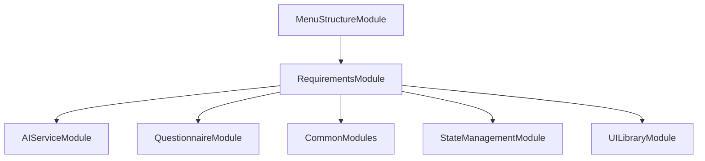

# FE-M003: RequirementsModule 상세 개발 설계서

## 1. 모듈 개요

### 1.1 모듈 식별 정보
- **모듈 ID**: FE-M003
- **모듈명**: RequirementsModule (요구사항 정의서 관리)
- **담당 개발자**: 프론트엔드 개발자 (React/TypeScript + 데이터 테이블 전문)
- **예상 개발 기간**: 4일
- **우선순위**: P0 (필수)

### 1.2 모듈 목적 및 범위
- **핵심 기능**: 
  1. 질의서 답변 기반 요구사항 자동 도출
  2. 표준 템플릿 기반 요구사항 정의서 생성
  3. 데이터 테이블 형태의 요구사항 관리
  4. 인라인 셀 편집 및 실시간 검증
  5. Excel import/export 기능
- **비즈니스 가치**: 질의서 답변을 체계적인 요구사항 정의서로 변환하여, 팀원들과 일관된 요구사항 문서로 소통 가능
- **제외 범위**: 요구사항 승인 워크플로우, 다른 단계와의 직접적 데이터 연동, 사용자 권한 관리

### 1.3 목표 사용자
- **주 사용자 그룹**: 프로젝트 매니저, 시스템 분석가, 개발팀 리더
- **사용자 페르소나**: 요구사항 관리 경험 3년 이상, Excel 기반 문서 관리에 익숙
- **사용 시나리오**: 질의서 완료 후 체계적인 요구사항 정의서 생성 및 관리, 팀 내 요구사항 공유

---

## 2. 기술 아키텍처

### 2.1 모듈 구조
```
RequirementsModule/
├── components/
│   ├── RequirementsTable.tsx      # 메인 요구사항 테이블
│   ├── RequirementRow.tsx         # 개별 요구사항 행
│   ├── RequirementEditor.tsx      # 요구사항 편집 모달
│   ├── ServiceTypeFilter.tsx      # 서비스 구분 필터
│   ├── PriorityFilter.tsx         # 우선순위 필터
│   ├── SearchBar.tsx              # 검색 기능
│   ├── ImportExportPanel.tsx      # 가져오기/내보내기 패널
│   └── ValidationSummary.tsx      # 검증 결과 요약
├── hooks/
│   ├── useRequirements.ts         # 요구사항 상태 관리
│   ├── useTableOperations.ts      # 테이블 작업 로직
│   ├── useImportExport.ts         # 가져오기/내보내기 로직
│   └── useValidation.ts           # 검증 로직
├── services/
│   ├── requirementsService.ts     # 요구사항 관리 서비스
│   ├── aiRequirementsService.ts   # AI 요구사항 도출 서비스
│   ├── importExportService.ts     # 가져오기/내보내기 서비스
│   └── validationService.ts       # 검증 서비스
├── types/
│   ├── requirementTypes.ts        # 요구사항 관련 타입 정의
│   ├── tableTypes.ts              # 테이블 관련 타입 정의
│   └── importExportTypes.ts       # 가져오기/내보내기 타입 정의
├── utils/
│   ├── requirementValidation.ts   # 요구사항 유효성 검증
│   ├── excelUtils.ts              # Excel 처리 유틸리티
│   ├── requirementGenerator.ts    # 요구사항 ID 생성
│   └── tableUtils.ts              # 테이블 유틸리티
├── templates/
│   ├── requirementTemplate.ts     # 요구사항 템플릿
│   └── serviceTypeTemplate.ts     # 서비스 구분 템플릿
├── tests/
│   ├── RequirementsTable.test.tsx
│   ├── ImportExport.test.tsx
│   └── Validation.test.tsx
└── index.ts                       # 모듈 진입점
```

### 2.2 기술 스택
- **프레임워크**: React 18 + TypeScript
- **테이블 라이브러리**: @tanstack/react-table
- **상태관리**: Zustand (전역 상태) + React Hook (로컬 상태)
- **스타일링**: Tailwind CSS + Shadcn/ui
- **Excel 처리**: xlsx 라이브러리
- **테스트**: Jest + Testing Library

---

## 3. 인터페이스 정의

### 3.1 외부 의존성
```typescript
interface ExternalDependencies {
  modules: [
    'SH-M001: AIServiceModule',    // AI 요구사항 도출 서비스
    'FE-M002: QuestionnaireModule', // 질의서 답변 데이터
    'FE-M008: CommonModules'       // 공통 UI 컴포넌트
  ];
  apis: [
    '/api/requirements/generate',  // AI 요구사항 도출 API
    '/api/requirements/save',      // 요구사항 저장 API
    '/api/requirements/export',    // 요구사항 내보내기 API
    '/api/requirements/import'     // 요구사항 가져오기 API
  ];
  sharedComponents: [
    'Table', 'Input', 'Select', 'Button', 'Modal', 'Alert', 'Badge', 'Checkbox'
  ];
  utils: [
    'validateEmail', 'formatDate', 'generateId'
  ];
}
```

### 3.2 제공 인터페이스
```typescript
export interface RequirementsModuleInterface {
  components: {
    RequirementsModule: React.FC<RequirementsModuleProps>;
    RequirementsTable: React.FC<RequirementsTableProps>;
    RequirementEditor: React.FC<RequirementEditorProps>;
    ImportExportPanel: React.FC<ImportExportPanelProps>;
    ValidationSummary: React.FC<ValidationSummaryProps>;
  };
  
  hooks: {
    useRequirements: () => RequirementsHook;
    useTableOperations: () => TableOperationsHook;
    useImportExport: () => ImportExportHook;
    useValidation: () => ValidationHook;
  };
  
  services: {
    RequirementsService: RequirementsServiceClass;
    AIRequirementsService: AIRequirementsServiceClass;
    ImportExportService: ImportExportServiceClass;
  };
  
  types: {
    Requirement: RequirementType;
    ServiceType: ServiceTypeType;
    Priority: PriorityType;
  };
}
```

### 3.3 API 명세
```typescript
interface RequirementsAPIEndpoints {
  POST: {
    '/api/requirements/generate': {
      request: {
        questionnaireAnswers: QuestionnaireAnswer[];
        projectType: string;
      };
      response: {
        success: boolean;
        requirements: Requirement[];
        statistics: RequirementStatistics;
      };
      errors: ['GENERATION_FAILED', 'AI_SERVICE_ERROR', 'INVALID_INPUT'];
    };
  };
  
  PUT: {
    '/api/requirements/save': {
      request: {
        projectId: string;
        requirements: Requirement[];
      };
      response: {
        success: boolean;
        savedAt: Date;
        statistics: RequirementStatistics;
      };
      errors: ['SAVE_FAILED', 'VALIDATION_ERROR', 'PROJECT_NOT_FOUND'];
    };
  };
  
  GET: {
    '/api/requirements/export': {
      request: {
        projectId: string;
        format: 'excel' | 'csv' | 'json';
        filters?: RequirementFilters;
      };
      response: Blob;
      errors: ['EXPORT_FAILED', 'FORMAT_NOT_SUPPORTED'];
    };
  };
  
  POST: {
    '/api/requirements/import': {
      request: {
        projectId: string;
        file: File;
        format: 'excel' | 'csv';
      };
      response: {
        success: boolean;
        importedRequirements: Requirement[];
        errors: ImportError[];
      };
      errors: ['IMPORT_FAILED', 'INVALID_FORMAT', 'VALIDATION_ERROR'];
    };
  };
}
```

---

## 4. 데이터 모델

### 4.1 엔티티 정의
```typescript
interface Requirement {
  id: string;                    // REQ-001 형식
  number: number;                // 표시용 번호
  serviceType: ServiceType;      // F/O, B/O, API/RFC, AI
  name: string;                  // 요구사항명
  description: string;           // 상세설명
  priority: Priority;            // High, Medium, Low
  status: RequirementStatus;     // 작성중, 완료, 보류
  source: RequirementSource;     // 질의서, 수동입력, 가져오기
  relatedQuestions: string[];    // 관련 질문 ID 목록
  estimatedEffort: number;       // 예상 작업량 (인일)
  assignedTo: string;            // 담당자
  createdAt: Date;
  updatedAt: Date;
  createdBy: string;
  updatedBy: string;
}

interface ServiceType {
  id: 'FO' | 'BO' | 'API' | 'AI';
  name: string;
  description: string;
  color: string;
  icon: string;
}

interface Priority {
  id: 'High' | 'Medium' | 'Low';
  name: string;
  description: string;
  color: string;
  weight: number;
}

interface RequirementStatistics {
  total: number;
  byServiceType: Record<ServiceType['id'], number>;
  byPriority: Record<Priority['id'], number>;
  byStatus: Record<RequirementStatus, number>;
  completionRate: number;
}

interface RequirementFilters {
  serviceTypes?: ServiceType['id'][];
  priorities?: Priority['id'][];
  statuses?: RequirementStatus[];
  searchText?: string;
  assignedTo?: string[];
}
```

### 4.2 DTO 정의
```typescript
class RequirementGenerationRequestDTO {
  @IsArray()
  @ValidateNested({ each: true })
  questionnaireAnswers: QuestionnaireAnswer[];

  @IsString()
  @IsNotEmpty()
  projectType: string;
}

class RequirementSaveRequestDTO {
  @IsString()
  @IsNotEmpty()
  projectId: string;

  @IsArray()
  @ValidateNested({ each: true })
  requirements: Requirement[];
}

class RequirementExportRequestDTO {
  @IsString()
  @IsNotEmpty()
  projectId: string;

  @IsEnum(['excel', 'csv', 'json'])
  format: 'excel' | 'csv' | 'json';

  @IsOptional()
  @ValidateNested()
  filters?: RequirementFilters;
}

class RequirementImportRequestDTO {
  @IsString()
  @IsNotEmpty()
  projectId: string;

  @IsNotEmpty()
  file: File;

  @IsEnum(['excel', 'csv'])
  format: 'excel' | 'csv';
}
```

### 4.3 상태 관리 스키마
```typescript
interface RequirementsState {
  requirements: Requirement[];
  statistics: RequirementStatistics;
  filters: RequirementFilters;
  selectedRequirements: string[];
  isGenerating: boolean;
  isSaving: boolean;
  isImporting: boolean;
  isExporting: boolean;
  validationErrors: ValidationError[];
  importErrors: ImportError[];
  
  actions: {
    generateRequirements: (questionnaireAnswers: QuestionnaireAnswer[]) => Promise<void>;
    updateRequirement: (id: string, updates: Partial<Requirement>) => void;
    addRequirement: (requirement: Omit<Requirement, 'id'>) => void;
    removeRequirement: (id: string) => void;
    duplicateRequirement: (id: string) => void;
    bulkUpdateRequirements: (updates: Partial<Requirement>, ids: string[]) => void;
    applyFilters: (filters: RequirementFilters) => void;
    clearFilters: () => void;
    selectRequirements: (ids: string[]) => void;
    clearSelection: () => void;
    saveRequirements: () => Promise<void>;
    importRequirements: (file: File, format: string) => Promise<void>;
    exportRequirements: (format: string) => Promise<void>;
    validateRequirements: () => ValidationError[];
    resetRequirements: () => void;
  };
}
```

---

## 5. 핵심 컴포넌트/서비스 명세

### 5.1 주요 컴포넌트 (Frontend)
```typescript
interface RequirementsTableProps {
  requirements: Requirement[];
  statistics: RequirementStatistics;
  filters: RequirementFilters;
  selectedRequirements: string[];
  onRequirementUpdate: (id: string, updates: Partial<Requirement>) => void;
  onRequirementSelect: (ids: string[]) => void;
  onFiltersChange: (filters: RequirementFilters) => void;
  onBulkAction: (action: BulkAction, ids: string[]) => void;
}

const RequirementsTable: React.FC<RequirementsTableProps> = ({
  requirements,
  statistics,
  filters,
  selectedRequirements,
  onRequirementUpdate,
  onRequirementSelect,
  onFiltersChange,
  onBulkAction
}) => {
  // @tanstack/react-table 기반 테이블 구현
  // 인라인 편집 지원
  // 정렬, 필터링, 검색 기능
  // 다중 선택 및 벌크 액션
};

interface RequirementEditorProps {
  requirement: Requirement | null;
  isOpen: boolean;
  onSave: (requirement: Requirement) => void;
  onCancel: () => void;
  serviceTypes: ServiceType[];
  priorities: Priority[];
}

const RequirementEditor: React.FC<RequirementEditorProps> = ({
  requirement,
  isOpen,
  onSave,
  onCancel,
  serviceTypes,
  priorities
}) => {
  // 요구사항 편집 모달
  // 폼 유효성 검증
  // 서비스 구분 및 우선순위 선택
};

interface ImportExportPanelProps {
  onImport: (file: File, format: string) => Promise<void>;
  onExport: (format: string) => Promise<void>;
  isImporting: boolean;
  isExporting: boolean;
  importErrors: ImportError[];
  supportedFormats: string[];
}

const ImportExportPanel: React.FC<ImportExportPanelProps> = ({
  onImport,
  onExport,
  isImporting,
  isExporting,
  importErrors,
  supportedFormats
}) => {
  // 파일 가져오기/내보내기 패널
  // 드래그&드롭 파일 업로드
  // 형식별 옵션 설정
  // 오류 메시지 표시
};
```

### 5.2 주요 서비스 (Backend)
```typescript
@Injectable()
export class AIRequirementsService {
  constructor(
    private readonly aiService: AIService,
    private readonly templateService: TemplateService
  ) {}
  
  async generateRequirements(
    questionnaireAnswers: QuestionnaireAnswer[],
    projectType: string
  ): Promise<Requirement[]> {
    // AI 기반 요구사항 도출
    // 서비스 구분 자동 분류
    // 우선순위 자동 설정
    // 요구사항 ID 자동 생성
  }
  
  async enhanceRequirements(requirements: Requirement[]): Promise<Requirement[]> {
    // 생성된 요구사항 개선
    // 중복 제거 및 통합
    // 상세 설명 보완
  }
  
  async categorizeByServiceType(requirements: Requirement[]): Promise<Record<ServiceType['id'], Requirement[]>> {
    // 서비스 구분별 분류
    // 통계 정보 생성
  }
}

@Injectable()
export class RequirementsService {
  constructor(
    private readonly repository: RequirementsRepository,
    private readonly validationService: ValidationService
  ) {}
  
  async saveRequirements(
    projectId: string,
    requirements: Requirement[]
  ): Promise<RequirementStatistics> {
    // 요구사항 저장
    // 유효성 검증
    // 통계 정보 업데이트
  }
  
  async loadRequirements(projectId: string): Promise<Requirement[]> {
    // 요구사항 로드
    // 필터링 적용
  }
  
  async validateRequirements(requirements: Requirement[]): Promise<ValidationError[]> {
    // 요구사항 유효성 검증
    // 중복 검사
    // 필수 필드 검증
  }
}

@Injectable()
export class ImportExportService {
  constructor(
    private readonly fileService: FileService,
    private readonly excelService: ExcelService
  ) {}
  
  async exportToExcel(
    requirements: Requirement[],
    filters?: RequirementFilters
  ): Promise<Blob> {
    // Excel 형식으로 내보내기
    // 워크시트별 구조화
    // 필터링된 데이터만 내보내기
  }
  
  async exportToCSV(
    requirements: Requirement[],
    filters?: RequirementFilters
  ): Promise<Blob> {
    // CSV 형식으로 내보내기
    // UTF-8 BOM 포함
  }
  
  async importFromExcel(file: File): Promise<ImportResult> {
    // Excel 파일 가져오기
    // 시트별 데이터 파싱
    // 유효성 검증
  }
  
  async importFromCSV(file: File): Promise<ImportResult> {
    // CSV 파일 가져오기
    // 인코딩 자동 감지
    // 구분자 자동 감지
  }
}
```

---

## 6. 이벤트 및 메시징

### 6.1 발행 이벤트
```typescript
enum RequirementsEvents {
  REQUIREMENTS_GENERATED = 'requirements.generated',
  REQUIREMENT_UPDATED = 'requirements.requirement.updated',
  REQUIREMENT_ADDED = 'requirements.requirement.added',
  REQUIREMENT_REMOVED = 'requirements.requirement.removed',
  REQUIREMENTS_SAVED = 'requirements.saved',
  REQUIREMENTS_IMPORTED = 'requirements.imported',
  REQUIREMENTS_EXPORTED = 'requirements.exported',
  VALIDATION_COMPLETED = 'requirements.validation.completed',
  MODULE_COMPLETED = 'requirements.module.completed'
}

interface RequirementsEventPayload {
  eventType: RequirementsEvents;
  data: {
    projectId: string;
    requirementId?: string;
    requirements?: Requirement[];
    statistics?: RequirementStatistics;
    validationErrors?: ValidationError[];
    importErrors?: ImportError[];
    exportFormat?: string;
  };
  timestamp: Date;
}
```

### 6.2 구독 이벤트
```typescript
interface SubscribedEvents {
  'questionnaire.module.completed': (payload: QuestionnaireCompletedPayload) => void;
  'project.deleted': (payload: ProjectDeletedPayload) => void;
  'user.logout': (payload: UserLogoutPayload) => void;
}
```

---

## 7. 에러 처리

### 7.1 에러 코드 정의
```typescript
enum RequirementsErrorCode {
  GENERATION_FAILED = 'FE_M003_001',
  AI_SERVICE_ERROR = 'FE_M003_002',
  INVALID_REQUIREMENT_FORMAT = 'FE_M003_003',
  SAVE_FAILED = 'FE_M003_004',
  VALIDATION_ERROR = 'FE_M003_005',
  IMPORT_FAILED = 'FE_M003_006',
  EXPORT_FAILED = 'FE_M003_007',
  DUPLICATE_REQUIREMENT = 'FE_M003_008',
  PROJECT_NOT_FOUND = 'FE_M003_009'
}
```

### 7.2 에러 처리 전략
- **Frontend**: 사용자 친화적 에러 메시지, 부분 저장 기능, 가져오기 오류 상세 표시
- **Backend**: 구조화된 에러 응답, 상세 로깅, 폴백 요구사항 제공

---

## 8. 테스트 전략

### 8.1 단위 테스트
```typescript
describe('RequirementsModule', () => {
  describe('AIRequirementsService', () => {
    it('should generate requirements from questionnaire answers', async () => {
      // AI 요구사항 도출 테스트
    });
    
    it('should categorize requirements by service type', async () => {
      // 서비스 구분 분류 테스트
    });
  });
  
  describe('RequirementsTable', () => {
    it('should handle inline editing correctly', () => {
      // 인라인 편집 테스트
    });
    
    it('should apply filters and sorting', () => {
      // 필터링 및 정렬 테스트
    });
  });
  
  describe('ImportExportService', () => {
    it('should import Excel files correctly', async () => {
      // Excel 가져오기 테스트
    });
    
    it('should export to different formats', async () => {
      // 다양한 형식 내보내기 테스트
    });
  });
});
```

### 8.2 통합 테스트
- **API 테스트**: 요구사항 생성, 저장, 가져오기/내보내기 API 통합 테스트
- **E2E 테스트**: 질의서 → 요구사항 생성 → 편집 → 내보내기 플로우
- **목업 데이터**: 다양한 프로젝트 유형별 요구사항 템플릿

### 8.3 테스트 커버리지 목표
- **단위 테스트**: 85% 이상
- **통합 테스트**: 핵심 플로우 100%

---

## 9. 성능 최적화

### 9.1 캐싱 전략
- **요구사항 캐싱**: 로드된 요구사항 메모리 캐싱
- **통계 캐싱**: 요구사항 통계 정보 메모리 캐싱
- **템플릿 캐싱**: 서비스 구분 및 우선순위 템플릿 캐싱

### 9.2 최적화 기법
- **가상화**: 대량 요구사항 목록 가상 스크롤링
- **지연 로딩**: 필터링된 데이터만 렌더링
- **메모이제이션**: 필터링 및 정렬 결과 메모이제이션

---

## 10. 보안 고려사항

### 10.1 인증/인가
- **JWT 검증**: 모든 API 호출 시 토큰 검증
- **프로젝트 권한**: 프로젝트별 요구사항 접근 권한 체크
- **입력 검증**: 요구사항 텍스트 XSS 방지

### 10.2 데이터 보호
- **민감 정보**: 요구사항 내용 중 민감 정보 필터링
- **XSS 방지**: 사용자 입력 데이터 삭제화
- **CSRF 보호**: 저장 요청 시 CSRF 토큰 검증

---

## 11. 배포 및 모니터링

### 11.1 환경 변수
```env
# 요구사항 관련 설정
VITE_MAX_REQUIREMENTS_PER_PROJECT=1000
VITE_AUTO_SAVE_INTERVAL=5000
VITE_BULK_OPERATION_LIMIT=100

# Excel 처리 설정
VITE_EXCEL_MAX_ROWS=10000
VITE_CSV_MAX_SIZE_MB=50
```

### 11.2 로깅 및 모니터링
- **로그 레벨**: Debug/Info/Warn/Error
- **메트릭**: 요구사항 생성 성공률, 편집 빈도, 가져오기/내보내기 성공률
- **알림**: AI 서비스 오류, 저장 실패, 가져오기 오류

---

## 12. 개발 가이드라인

### 12.1 코딩 컨벤션
- **네이밍**: camelCase (변수), PascalCase (컴포넌트/클래스)
- **파일 구조**: 기능별 그룹핑, 명확한 import/export
- **주석**: JSDoc 형식, 복잡한 요구사항 도출 로직 설명

### 12.2 Git 브랜치 전략
```
main
├── develop
│   ├── feature/FE-M003-requirements-table
│   ├── feature/FE-M003-import-export
│   └── fix/FE-M003-validation-bug
```

### 12.3 PR 체크리스트
- [ ] 단위 테스트 통과
- [ ] 코드 리뷰 승인
- [ ] 요구사항 생성 시나리오 테스트
- [ ] 테이블 편집 기능 테스트
- [ ] 가져오기/내보내기 기능 테스트
- [ ] 유효성 검증 테스트
- [ ] 성능 영향 검토

---

## 13. 의존성 그래프



---

이 설계서는 RequirementsModule의 독립적인 개발을 위한 완전한 가이드를 제공하며, AI 기반 요구사항 도출과 체계적인 데이터 테이블 관리를 중심으로 표준화된 요구사항 정의서 생성을 지원합니다.
