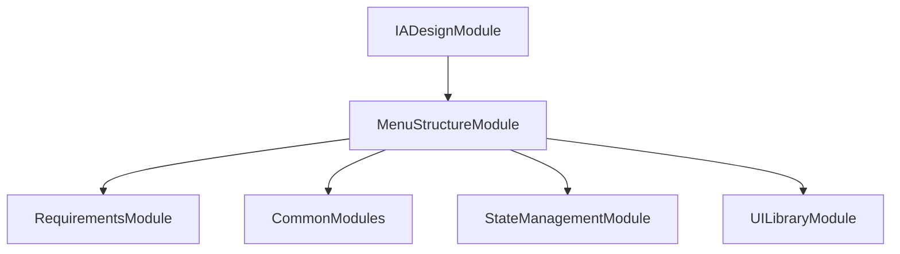

# FE-M004: MenuStructureModule 상세 개발 설계서

## 1. 모듈 개요

### 1.1 모듈 식별 정보
- **모듈 ID**: FE-M004
- **모듈명**: MenuStructureModule (메뉴구조도 설계)
- **담당 개발자**: 프론트엔드 개발자 (React/TypeScript + 트리 구조 전문)
- **예상 개발 기간**: 3일
- **우선순위**: P0 (필수)

### 1.2 모듈 목적 및 범위
- **핵심 기능**: 
  1. 5단계 계층 구조 트리 뷰 에디터
  2. 드래그&드롭 메뉴 재배치
  3. 접근 권한 및 관리 기능 설정
  4. 시각적 미리보기 및 내보내기
- **비즈니스 가치**: 요구사항 정의서를 바탕으로 사용자 경험을 고려한 체계적인 메뉴 구조 설계
- **제외 범위**: 실제 화면 개발, 사용자 권한 관리, 다른 단계와의 직접적 데이터 연동

### 1.3 목표 사용자
- **주 사용자 그룹**: 시스템 분석가, UI/UX 디자이너
- **사용자 페르소나**: 정보구조 설계 경험 2년 이상, 사용자 경험 중심의 메뉴 설계 능력 보유
- **사용 시나리오**: 요구사항 정의서 완료 후 시스템의 메뉴 구조를 시각적으로 설계하고 편집

---

## 2. 기술 아키텍처

### 2.1 모듈 구조
```
MenuStructureModule/
├── components/
│   ├── MenuStructureEditor.tsx    # 메인 메뉴 구조 에디터
│   ├── MenuTreeView.tsx           # 트리 뷰 컴포넌트
│   ├── MenuNode.tsx               # 개별 메뉴 노드
│   ├── MenuEditor.tsx             # 메뉴 편집 패널
│   ├── MenuPreview.tsx            # 시각적 미리보기
│   ├── AccessControlPanel.tsx     # 접근 권한 설정
│   └── ExportPanel.tsx            # 내보내기 패널
├── hooks/
│   ├── useMenuStructure.ts        # 메뉴 구조 상태 관리
│   ├── useTreeOperations.ts       # 트리 작업 로직
│   ├── useDragAndDrop.ts          # 드래그&드롭 로직
│   └── useMenuValidation.ts       # 메뉴 검증 로직
├── services/
│   ├── menuStructureService.ts    # 메뉴 구조 관리 서비스
│   ├── menuGenerationService.ts   # 메뉴 자동 생성 서비스
│   └── exportService.ts           # 내보내기 서비스
├── types/
│   ├── menuTypes.ts               # 메뉴 관련 타입 정의
│   ├── treeTypes.ts               # 트리 구조 타입 정의
│   └── accessTypes.ts             # 접근 권한 타입 정의
├── utils/
│   ├── treeUtils.ts               # 트리 유틸리티
│   ├── menuValidation.ts          # 메뉴 유효성 검증
│   ├── pathUtils.ts               # 경로 생성 유틸리티
│   └── exportUtils.ts             # 내보내기 유틸리티
├── templates/
│   ├── menuTemplates.ts           # 메뉴 템플릿
│   └── accessTemplates.ts         # 접근 권한 템플릿
├── tests/
│   ├── MenuStructureEditor.test.tsx
│   ├── TreeOperations.test.tsx
│   └── DragAndDrop.test.tsx
└── index.ts                       # 모듈 진입점
```

### 2.2 기술 스택
- **프레임워크**: React 18 + TypeScript
- **트리 라이브러리**: react-arborist 또는 @tanstack/react-virtual
- **드래그&드롭**: @dnd-kit/core
- **상태관리**: Zustand (전역 상태) + React Hook (로컬 상태)
- **스타일링**: Tailwind CSS + Shadcn/ui

---

## 3. 인터페이스 정의

### 3.1 외부 의존성
```typescript
interface ExternalDependencies {
  modules: [
    'FE-M003: RequirementsModule', // 요구사항 정의서 데이터
    'FE-M008: CommonModules'       // 공통 UI 컴포넌트
  ];
  apis: [
    '/api/menu-structure/save',    // 메뉴 구조 저장 API
    '/api/menu-structure/export',  // 메뉴 구조 내보내기 API
    '/api/menu-structure/validate' // 메뉴 구조 검증 API
  ];
  sharedComponents: [
    'Button', 'Input', 'Select', 'Checkbox', 'Card', 'Modal', 'Alert'
  ];
  utils: [
    'generateId', 'validatePath', 'formatMenuName'
  ];
}
```

### 3.2 제공 인터페이스
```typescript
export interface MenuStructureModuleInterface {
  components: {
    MenuStructureModule: React.FC<MenuStructureModuleProps>;
    MenuStructureEditor: React.FC<MenuStructureEditorProps>;
    MenuTreeView: React.FC<MenuTreeViewProps>;
    MenuEditor: React.FC<MenuEditorProps>;
    MenuPreview: React.FC<MenuPreviewProps>;
  };
  
  hooks: {
    useMenuStructure: () => MenuStructureHook;
    useTreeOperations: () => TreeOperationsHook;
    useDragAndDrop: () => DragAndDropHook;
    useMenuValidation: () => MenuValidationHook;
  };
  
  services: {
    MenuStructureService: MenuStructureServiceClass;
    MenuGenerationService: MenuGenerationServiceClass;
    ExportService: ExportServiceClass;
  };
  
  types: {
    MenuNode: MenuNodeType;
    MenuStructure: MenuStructureType;
    AccessLevel: AccessLevelType;
  };
}
```

---

## 4. 데이터 모델

### 4.1 엔티티 정의
```typescript
interface MenuNode {
  id: string;
  name: string;
  depth1: string;
  depth2: string;
  depth3: string;
  depth4: string;
  depth5: string;
  screenName: string;
  accessLevel: AccessLevel;
  hasAdmin: boolean;
  expanded: boolean;
  children: MenuNode[];
  parentId?: string;
  order: number;
  isGenerated: boolean;
  relatedRequirements: string[];
  createdAt: Date;
  updatedAt: Date;
}

interface AccessLevel {
  id: 'all' | 'login' | 'admin';
  name: string;
  description: string;
  color: string;
}

interface MenuStructure {
  id: string;
  projectId: string;
  title: string;
  description: string;
  menuData: MenuNode[];
  statistics: MenuStatistics;
  validationStatus: ValidationStatus;
  createdAt: Date;
  updatedAt: Date;
}

interface MenuStatistics {
  totalMenus: number;
  maxDepth: number;
  byAccessLevel: Record<AccessLevel['id'], number>;
  byDepth: Record<number, number>;
  adminMenus: number;
}
```

### 4.2 상태 관리 스키마
```typescript
interface MenuStructureState {
  menuStructure: MenuStructure | null;
  selectedNode: MenuNode | null;
  isGenerating: boolean;
  isSaving: boolean;
  isExporting: boolean;
  validationErrors: ValidationError[];
  dragState: DragState | null;
  
  actions: {
    generateFromRequirements: (requirements: Requirement[]) => Promise<void>;
    addMenuNode: (parentId?: string) => void;
    updateMenuNode: (id: string, updates: Partial<MenuNode>) => void;
    removeMenuNode: (id: string) => void;
    moveMenuNode: (nodeId: string, targetParentId: string, targetIndex: number) => void;
    expandNode: (id: string) => void;
    collapseNode: (id: string) => void;
    selectNode: (node: MenuNode | null) => void;
    validateMenuStructure: () => ValidationError[];
    saveMenuStructure: () => Promise<void>;
    exportMenuStructure: (format: string) => Promise<void>;
    resetMenuStructure: () => void;
  };
}
```

---

## 5. 핵심 컴포넌트/서비스 명세

### 5.1 주요 컴포넌트 (Frontend)
```typescript
interface MenuStructureEditorProps {
  projectId: string;
  requirements: Requirement[];
  onComplete: (menuStructure: MenuStructure) => void;
  onBack: () => void;
}

const MenuStructureEditor: React.FC<MenuStructureEditorProps> = ({
  projectId,
  requirements,
  onComplete,
  onBack
}) => {
  // 메인 메뉴 구조 에디터
  // 요구사항 기반 자동 생성
  // 트리 뷰 및 편집 패널 통합
};

interface MenuTreeViewProps {
  menuData: MenuNode[];
  selectedNode: MenuNode | null;
  onNodeSelect: (node: MenuNode) => void;
  onNodeUpdate: (id: string, updates: Partial<MenuNode>) => void;
  onNodeMove: (nodeId: string, targetParentId: string, targetIndex: number) => void;
  onNodeAdd: (parentId?: string) => void;
  onNodeRemove: (id: string) => void;
  dragState: DragState | null;
  onDragStart: (nodeId: string) => void;
  onDragEnd: () => void;
}

const MenuTreeView: React.FC<MenuTreeViewProps> = ({
  menuData,
  selectedNode,
  onNodeSelect,
  onNodeUpdate,
  onNodeMove,
  onNodeAdd,
  onNodeRemove,
  dragState,
  onDragStart,
  onDragEnd
}) => {
  // 트리 뷰 렌더링
  // 드래그&드롭 지원
  // 컨텍스트 메뉴
  // 접기/펼치기 기능
};
```

### 5.2 주요 서비스 (Backend)
```typescript
@Injectable()
export class MenuGenerationService {
  constructor(
    private readonly templateService: TemplateService
  ) {}
  
  async generateFromRequirements(requirements: Requirement[]): Promise<MenuNode[]> {
    // 요구사항 기반 메뉴 자동 생성
    // 서비스 구분별 메뉴 구조 생성
    // 계층 구조 자동 설정
  }
  
  async optimizeMenuStructure(menuData: MenuNode[]): Promise<MenuNode[]> {
    // 메뉴 구조 최적화
    // 중복 제거 및 통합
    // 사용자 경험 개선
  }
}

@Injectable()
export class MenuStructureService {
  constructor(
    private readonly repository: MenuStructureRepository,
    private readonly validationService: ValidationService
  ) {}
  
  async saveMenuStructure(
    projectId: string,
    menuStructure: MenuStructure
  ): Promise<void> {
    // 메뉴 구조 저장
    // 유효성 검증
    // 통계 정보 업데이트
  }
  
  async validateMenuStructure(menuStructure: MenuStructure): Promise<ValidationError[]> {
    // 메뉴 구조 유효성 검증
    // 경로 중복 검사
    // 접근 권한 검증
  }
}
```

---

## 6. 이벤트 및 메시징

### 6.1 발행 이벤트
```typescript
enum MenuStructureEvents {
  MENU_STRUCTURE_GENERATED = 'menustructure.generated',
  MENU_NODE_ADDED = 'menustructure.node.added',
  MENU_NODE_UPDATED = 'menustructure.node.updated',
  MENU_NODE_REMOVED = 'menustructure.node.removed',
  MENU_NODE_MOVED = 'menustructure.node.moved',
  MENU_STRUCTURE_SAVED = 'menustructure.saved',
  MENU_STRUCTURE_EXPORTED = 'menustructure.exported',
  VALIDATION_COMPLETED = 'menustructure.validation.completed',
  MODULE_COMPLETED = 'menustructure.module.completed'
}
```

### 6.2 구독 이벤트
```typescript
interface SubscribedEvents {
  'requirements.module.completed': (payload: RequirementsCompletedPayload) => void;
  'project.deleted': (payload: ProjectDeletedPayload) => void;
  'user.logout': (payload: UserLogoutPayload) => void;
}
```

---

## 7. 에러 처리

### 7.1 에러 코드 정의
```typescript
enum MenuStructureErrorCode {
  GENERATION_FAILED = 'FE_M004_001',
  INVALID_MENU_STRUCTURE = 'FE_M004_002',
  DUPLICATE_PATH = 'FE_M004_003',
  SAVE_FAILED = 'FE_M004_004',
  VALIDATION_ERROR = 'FE_M004_005',
  EXPORT_FAILED = 'FE_M004_006',
  PROJECT_NOT_FOUND = 'FE_M004_007'
}
```

---

## 8. 테스트 전략

### 8.1 단위 테스트
```typescript
describe('MenuStructureModule', () => {
  describe('MenuGenerationService', () => {
    it('should generate menu structure from requirements', async () => {
      // 요구사항 기반 메뉴 생성 테스트
    });
  });
  
  describe('MenuTreeView', () => {
    it('should handle drag and drop correctly', () => {
      // 드래그&드롭 테스트
    });
    
    it('should validate menu structure', () => {
      // 메뉴 구조 검증 테스트
    });
  });
});
```

---

## 9. 성능 최적화

### 9.1 캐싱 전략
- **메뉴 구조 캐싱**: 로드된 메뉴 구조 메모리 캐싱
- **통계 캐싱**: 메뉴 통계 정보 메모리 캐싱

### 9.2 최적화 기법
- **가상화**: 대량 메뉴 노드 가상 렌더링
- **메모이제이션**: 트리 구조 렌더링 결과 메모이제이션

---

## 10. 보안 고려사항

### 10.1 인증/인가
- **JWT 검증**: 모든 API 호출 시 토큰 검증
- **프로젝트 권한**: 프로젝트별 메뉴 구조 접근 권한 체크

### 10.2 데이터 보호
- **입력 검증**: 메뉴명 및 경로 XSS 방지
- **CSRF 보호**: 저장 요청 시 CSRF 토큰 검증

---

## 11. 배포 및 모니터링

### 11.1 환경 변수
```env
# 메뉴 구조 관련 설정
VITE_MAX_MENU_DEPTH=5
VITE_MAX_MENUS_PER_LEVEL=50
VITE_AUTO_SAVE_INTERVAL=3000
```

### 11.2 로깅 및 모니터링
- **로그 레벨**: Debug/Info/Warn/Error
- **메트릭**: 메뉴 생성 성공률, 편집 빈도, 검증 오류율
- **알림**: 저장 실패, 검증 오류

---

## 12. 개발 가이드라인

### 12.1 코딩 컨벤션
- **네이밍**: camelCase (변수), PascalCase (컴포넌트/클래스)
- **파일 구조**: 기능별 그룹핑, 명확한 import/export
- **주석**: JSDoc 형식, 복잡한 트리 작업 로직 설명

### 12.2 Git 브랜치 전략
```
main
├── develop
│   ├── feature/FE-M004-menu-tree
│   ├── feature/FE-M004-drag-drop
│   └── fix/FE-M004-validation-bug
```

### 12.3 PR 체크리스트
- [ ] 단위 테스트 통과
- [ ] 코드 리뷰 승인
- [ ] 메뉴 생성 시나리오 테스트
- [ ] 드래그&드롭 기능 테스트
- [ ] 검증 기능 테스트
- [ ] 성능 영향 검토

---

## 13. 의존성 그래프



---

이 설계서는 MenuStructureModule의 독립적인 개발을 위한 완전한 가이드를 제공하며, 요구사항 기반 메뉴 자동 생성과 직관적인 트리 에디터를 중심으로 체계적인 메뉴 구조 설계를 지원합니다.
