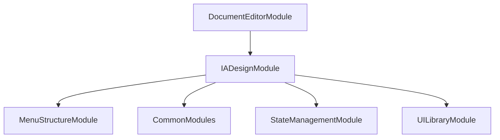

# FE-M005: IADesignModule 상세 개발 설계서

## 1. 모듈 개요

### 1.1 모듈 식별 정보
- **모듈 ID**: FE-M005
- **모듈명**: IADesignModule (IA 디자인 및 와이어프레임 빌더)
- **담당 개발자**: UI/UX 개발자 (React/TypeScript + 드래그앤드롭 전문)
- **예상 개발 기간**: 6일
- **우선순위**: P0 (필수)

### 1.2 모듈 목적 및 범위
- **핵심 기능**: 
  1. 드래그앤드롭 와이어프레임 빌더
  2. 8개 카테고리 컴포넌트 라이브러리
  3. IA Code 자동 생성 (SCR-001, FRM-001-01 형식)
  4. 반응형 캔버스 (PC/Tablet/Mobile)
  5. 컴포넌트 속성 편집 패널
- **비즈니스 가치**: 메뉴구조도를 바탕으로 각 화면의 정보구조를 설계하고, 직관적인 와이어프레임 도구로 기초 화면설계 구현
- **제외 범위**: 실제 디자인 작업, 코드 생성, 다른 단계와의 직접적 데이터 연동

### 1.3 목표 사용자
- **주 사용자 그룹**: UI/UX 디자이너, 시스템 분석가, 개발팀 리더
- **사용자 페르소나**: 와이어프레임 도구 사용 경험 2년 이상, 정보구조 설계 능력 보유
- **사용 시나리오**: 메뉴구조도 완성 후 각 화면별 와이어프레임 제작, 개발팀과의 화면 구조 논의

---

## 2. 기술 아키텍처

### 2.1 모듈 구조
```
IADesignModule/
├── components/
│   ├── IADesignCanvas.tsx         # 메인 캔버스 컴포넌트
│   ├── ComponentLibrary.tsx       # 컴포넌트 라이브러리
│   ├── ComponentPalette.tsx       # 컴포넌트 팔레트
│   ├── CanvasArea.tsx             # 캔버스 영역
│   ├── PropertiesPanel.tsx        # 속성 편집 패널
│   ├── IACodePanel.tsx            # IA Code 관리 패널
│   ├── ResponsiveControls.tsx     # 반응형 컨트롤
│   └── ZoomControls.tsx           # 줌 컨트롤
├── hooks/
│   ├── useIADesign.ts             # IA 디자인 상태 관리
│   ├── useCanvas.ts               # 캔버스 로직
│   ├── useDragAndDrop.ts          # 드래그&드롭 로직
│   ├── useComponentLibrary.ts     # 컴포넌트 라이브러리 로직
│   ├── usePropertiesEditor.ts     # 속성 편집 로직
│   └── useIACodeGenerator.ts      # IA Code 생성 로직
├── services/
│   ├── iaDesignService.ts         # IA 디자인 관리 서비스
│   ├── componentService.ts        # 컴포넌트 관리 서비스
│   ├── iACodeService.ts           # IA Code 생성 서비스
│   └── exportService.ts           # 내보내기 서비스
├── types/
│   ├── iaTypes.ts                 # IA 관련 타입 정의
│   ├── componentTypes.ts          # 컴포넌트 타입 정의
│   ├── canvasTypes.ts             # 캔버스 타입 정의
│   └── iACodeTypes.ts             # IA Code 타입 정의
├── utils/
│   ├── canvasUtils.ts             # 캔버스 유틸리티
│   ├── componentUtils.ts          # 컴포넌트 유틸리티
│   ├── iACodeUtils.ts             # IA Code 유틸리티
│   ├── snapUtils.ts               # 스냅 유틸리티
│   └── exportUtils.ts             # 내보내기 유틸리티
├── libraries/
│   ├── components/
│   │   ├── layout/
│   │   │   ├── Container.tsx
│   │   │   ├── Grid.tsx
│   │   │   └── Flex.tsx
│   │   ├── navigation/
│   │   │   ├── Header.tsx
│   │   │   ├── Sidebar.tsx
│   │   │   └── Breadcrumb.tsx
│   │   ├── content/
│   │   │   ├── Card.tsx
│   │   │   ├── List.tsx
│   │   │   └── Table.tsx
│   │   ├── form/
│   │   │   ├── Input.tsx
│   │   │   ├── Button.tsx
│   │   │   └── Select.tsx
│   │   ├── feedback/
│   │   │   ├── Alert.tsx
│   │   │   ├── Modal.tsx
│   │   │   └── Toast.tsx
│   │   ├── data/
│   │   │   ├── Chart.tsx
│   │   │   ├── Progress.tsx
│   │   │   └── Badge.tsx
│   │   ├── media/
│   │   │   ├── Image.tsx
│   │   │   ├── Video.tsx
│   │   │   └── Icon.tsx
│   │   └── utility/
│   │       ├── Divider.tsx
│   │       ├── Spacer.tsx
│   │       └── Text.tsx
│   └── index.ts
├── templates/
│   ├── componentTemplates.ts      # 컴포넌트 템플릿
│   ├── layoutTemplates.ts         # 레이아웃 템플릿
│   └── iACodeTemplates.ts         # IA Code 템플릿
├── tests/
│   ├── IADesignCanvas.test.tsx
│   ├── ComponentLibrary.test.tsx
│   └── DragAndDrop.test.tsx
└── index.ts                       # 모듈 진입점
```

### 2.2 기술 스택
- **프레임워크**: React 18 + TypeScript
- **드래그&드롭**: @dnd-kit/core
- **캔버스**: react-rnd 또는 react-flow
- **상태관리**: Zustand (전역 상태) + React Hook (로컬 상태)
- **스타일링**: Tailwind CSS + Shadcn/ui

---

## 3. 인터페이스 정의

### 3.1 외부 의존성
```typescript
interface ExternalDependencies {
  modules: [
    'FE-M004: MenuStructureModule', // 메뉴구조도 데이터
    'FE-M008: CommonModules'        // 공통 UI 컴포넌트
  ];
  apis: [
    '/api/ia-design/save',          // IA 디자인 저장 API
    '/api/ia-design/export',        // IA 디자인 내보내기 API
    '/api/ia-code/generate'         // IA Code 생성 API
  ];
  sharedComponents: [
    'Button', 'Input', 'Select', 'Modal', 'Tabs', 'Panel'
  ];
  utils: [
    'generateId', 'validatePosition', 'formatIACode'
  ];
}
```

### 3.2 제공 인터페이스
```typescript
export interface IADesignModuleInterface {
  components: {
    IADesignModule: React.FC<IADesignModuleProps>;
    IADesignCanvas: React.FC<IADesignCanvasProps>;
    ComponentLibrary: React.FC<ComponentLibraryProps>;
    PropertiesPanel: React.FC<PropertiesPanelProps>;
    IACodePanel: React.FC<IACodePanelProps>;
  };
  
  hooks: {
    useIADesign: () => IADesignHook;
    useCanvas: () => CanvasHook;
    useDragAndDrop: () => DragAndDropHook;
    useComponentLibrary: () => ComponentLibraryHook;
    usePropertiesEditor: () => PropertiesEditorHook;
  };
  
  services: {
    IADesignService: IADesignServiceClass;
    ComponentService: ComponentServiceClass;
    IACodeService: IACodeServiceClass;
  };
  
  types: {
    IADesign: IADesignType;
    Component: ComponentType;
    IACode: IACodeType;
  };
}
```

---

## 4. 데이터 모델

### 4.1 엔티티 정의
```typescript
interface IADesign {
  id: string;
  projectId: string;
  title: string;
  description: string;
  screens: IAScreen[];
  components: Component[];
  iACodes: IACode[];
  settings: IADesignSettings;
  createdAt: Date;
  updatedAt: Date;
}

interface IAScreen {
  id: string;
  name: string;
  iACode: string; // SCR-001 형식
  menuNodeId: string;
  deviceType: DeviceType;
  canvasSize: CanvasSize;
  components: Component[];
  frames: Frame[];
  createdAt: Date;
  updatedAt: Date;
}

interface Component {
  id: string;
  type: ComponentType;
  category: ComponentCategory;
  name: string;
  position: Position;
  size: Size;
  properties: ComponentProperties;
  children: string[];
  parent?: string;
  iACode: string; // FRM-001-01 형식
  isLocked: boolean;
  isVisible: boolean;
  zIndex: number;
  createdAt: Date;
  updatedAt: Date;
}

interface Frame {
  id: string;
  name: string;
  iACode: string; // FRM-001 형식
  components: string[];
  position: Position;
  size: Size;
  isCollapsed: boolean;
}

interface IACode {
  screenId: string;
  frameId?: string;
  componentId?: string;
  code: string;
  name: string;
  type: 'screen' | 'frame' | 'component';
  parent?: string;
}

interface ComponentProperties {
  [key: string]: any;
  // 컴포넌트별 동적 속성
  text?: string;
  color?: string;
  backgroundColor?: string;
  fontSize?: number;
  width?: number;
  height?: number;
  // ... 기타 속성들
}
```

### 4.2 상태 관리 스키마
```typescript
interface IADesignState {
  iaDesign: IADesign | null;
  currentScreen: IAScreen | null;
  selectedComponents: string[];
  draggedComponent: Component | null;
  canvasSettings: CanvasSettings;
  componentLibrary: ComponentLibrary;
  isGenerating: boolean;
  isSaving: boolean;
  isExporting: boolean;
  validationErrors: ValidationError[];
  
  actions: {
    generateFromMenuStructure: (menuStructure: MenuStructure) => Promise<void>;
    createScreen: (menuNode: MenuNode) => IAScreen;
    updateScreen: (screenId: string, updates: Partial<IAScreen>) => void;
    deleteScreen: (screenId: string) => void;
    addComponent: (component: Component, screenId: string) => void;
    updateComponent: (componentId: string, updates: Partial<Component>) => void;
    deleteComponent: (componentId: string) => void;
    moveComponent: (componentId: string, newPosition: Position) => void;
    resizeComponent: (componentId: string, newSize: Size) => void;
    selectComponents: (componentIds: string[]) => void;
    clearSelection: () => void;
    startDrag: (component: Component) => void;
    endDrag: () => void;
    generateIACodes: () => void;
    saveIADesign: () => Promise<void>;
    exportIADesign: (format: string) => Promise<void>;
    resetIADesign: () => void;
  };
}
```

---

## 5. 핵심 컴포넌트/서비스 명세

### 5.1 주요 컴포넌트 (Frontend)
```typescript
interface IADesignCanvasProps {
  screens: IAScreen[];
  currentScreen: IAScreen | null;
  selectedComponents: string[];
  draggedComponent: Component | null;
  canvasSettings: CanvasSettings;
  onScreenSelect: (screenId: string) => void;
  onComponentSelect: (componentIds: string[]) => void;
  onComponentUpdate: (componentId: string, updates: Partial<Component>) => void;
  onComponentMove: (componentId: string, position: Position) => void;
  onComponentResize: (componentId: string, size: Size) => void;
  onComponentAdd: (component: Component) => void;
  onComponentDelete: (componentId: string) => void;
  onDragStart: (component: Component) => void;
  onDragEnd: () => void;
}

const IADesignCanvas: React.FC<IADesignCanvasProps> = ({
  screens,
  currentScreen,
  selectedComponents,
  draggedComponent,
  canvasSettings,
  onScreenSelect,
  onComponentSelect,
  onComponentUpdate,
  onComponentMove,
  onComponentResize,
  onComponentAdd,
  onComponentDelete,
  onDragStart,
  onDragEnd
}) => {
  // 메인 캔버스 컴포넌트
  // 드래그&드롭 지원
  // 컴포넌트 선택 및 편집
  // 줌 및 팬 기능
};

interface ComponentLibraryProps {
  components: ComponentTemplate[];
  categories: ComponentCategory[];
  onComponentDrag: (component: ComponentTemplate) => void;
  searchQuery: string;
  selectedCategory: string | null;
  onSearchChange: (query: string) => void;
  onCategorySelect: (category: string | null) => void;
}

const ComponentLibrary: React.FC<ComponentLibraryProps> = ({
  components,
  categories,
  onComponentDrag,
  searchQuery,
  selectedCategory,
  onSearchChange,
  onCategorySelect
}) => {
  // 컴포넌트 라이브러리
  // 카테고리별 분류
  // 검색 기능
  // 드래그 시작 이벤트
};

interface PropertiesPanelProps {
  selectedComponents: Component[];
  onPropertyUpdate: (componentId: string, property: string, value: any) => void;
  onComponentUpdate: (componentId: string, updates: Partial<Component>) => void;
}

const PropertiesPanel: React.FC<PropertiesPanelProps> = ({
  selectedComponents,
  onPropertyUpdate,
  onComponentUpdate
}) => {
  // 속성 편집 패널
  // 다중 선택 지원
  // 실시간 속성 업데이트
};
```

### 5.2 주요 서비스 (Backend)
```typescript
@Injectable()
export class IADesignService {
  constructor(
    private readonly repository: IADesignRepository,
    private readonly validationService: ValidationService
  ) {}
  
  async generateFromMenuStructure(
    menuStructure: MenuStructure
  ): Promise<IADesign> {
    // 메뉴구조도 기반 IA 디자인 생성
    // 화면별 기본 레이아웃 생성
    // 컴포넌트 자동 배치
  }
  
  async saveIADesign(
    projectId: string,
    iaDesign: IADesign
  ): Promise<void> {
    // IA 디자인 저장
    // 유효성 검증
    // 버전 관리
  }
  
  async validateIADesign(iaDesign: IADesign): Promise<ValidationError[]> {
    // IA 디자인 유효성 검증
    // IA Code 중복 검사
    // 컴포넌트 배치 검증
  }
}

@Injectable()
export class IACodeService {
  constructor(
    private readonly templateService: TemplateService
  ) {}
  
  async generateIACodes(iaDesign: IADesign): Promise<IACode[]> {
    // IA Code 자동 생성
    // 화면-프레임-컴포넌트 계층 구조
    // 고유 코드 보장
  }
  
  async validateIACodes(iACodes: IACode[]): Promise<ValidationError[]> {
    // IA Code 유효성 검증
    // 중복 검사
    // 형식 검증
  }
  
  async exportIACodes(iaDesign: IADesign): Promise<Blob> {
    // IA Code 내보내기
    // Excel/JSON 형식 지원
  }
}
```

---

## 6. 이벤트 및 메시징

### 6.1 발행 이벤트
```typescript
enum IADesignEvents {
  IA_DESIGN_GENERATED = 'iadesign.generated',
  SCREEN_CREATED = 'iadesign.screen.created',
  SCREEN_UPDATED = 'iadesign.screen.updated',
  SCREEN_DELETED = 'iadesign.screen.deleted',
  COMPONENT_ADDED = 'iadesign.component.added',
  COMPONENT_UPDATED = 'iadesign.component.updated',
  COMPONENT_DELETED = 'iadesign.component.deleted',
  COMPONENT_MOVED = 'iadesign.component.moved',
  IA_CODES_GENERATED = 'iadesign.ia-codes.generated',
  IA_DESIGN_SAVED = 'iadesign.saved',
  IA_DESIGN_EXPORTED = 'iadesign.exported',
  MODULE_COMPLETED = 'iadesign.module.completed'
}
```

### 6.2 구독 이벤트
```typescript
interface SubscribedEvents {
  'menustructure.module.completed': (payload: MenuStructureCompletedPayload) => void;
  'project.deleted': (payload: ProjectDeletedPayload) => void;
  'user.logout': (payload: UserLogoutPayload) => void;
}
```

---

## 7. 에러 처리

### 7.1 에러 코드 정의
```typescript
enum IADesignErrorCode {
  GENERATION_FAILED = 'FE_M005_001',
  INVALID_IA_DESIGN = 'FE_M005_002',
  DUPLICATE_IA_CODE = 'FE_M005_003',
  COMPONENT_POSITION_INVALID = 'FE_M005_004',
  SAVE_FAILED = 'FE_M005_005',
  VALIDATION_ERROR = 'FE_M005_006',
  EXPORT_FAILED = 'FE_M005_007',
  PROJECT_NOT_FOUND = 'FE_M005_008'
}
```

---

## 8. 테스트 전략

### 8.1 단위 테스트
```typescript
describe('IADesignModule', () => {
  describe('IADesignCanvas', () => {
    it('should handle drag and drop correctly', () => {
      // 드래그&드롭 테스트
    });
    
    it('should update component properties', () => {
      // 컴포넌트 속성 업데이트 테스트
    });
  });
  
  describe('IACodeService', () => {
    it('should generate unique IA codes', async () => {
      // IA Code 생성 테스트
    });
    
    it('should validate IA code format', () => {
      // IA Code 형식 검증 테스트
    });
  });
});
```

---

## 9. 성능 최적화

### 9.1 캐싱 전략
- **컴포넌트 라이브러리 캐싱**: 컴포넌트 템플릿 메모리 캐싱
- **IA 디자인 캐싱**: 로드된 IA 디자인 메모리 캐싱

### 9.2 최적화 기법
- **가상화**: 대량 컴포넌트 가상 렌더링
- **메모이제이션**: 캔버스 렌더링 결과 메모이제이션
- **디바운싱**: 컴포넌트 이동/리사이즈 디바운싱

---

## 10. 보안 고려사항

### 10.1 인증/인가
- **JWT 검증**: 모든 API 호출 시 토큰 검증
- **프로젝트 권한**: 프로젝트별 IA 디자인 접근 권한 체크

### 10.2 데이터 보호
- **입력 검증**: 컴포넌트 속성 XSS 방지
- **CSRF 보호**: 저장 요청 시 CSRF 토큰 검증

---

## 11. 배포 및 모니터링

### 11.1 환경 변수
```env
# IA 디자인 관련 설정
VITE_MAX_COMPONENTS_PER_SCREEN=200
VITE_CANVAS_MAX_SIZE=4000
VITE_AUTO_SAVE_INTERVAL=5000
VITE_ZOOM_MIN=0.1
VITE_ZOOM_MAX=3.0
```

### 11.2 로깅 및 모니터링
- **로그 레벨**: Debug/Info/Warn/Error
- **메트릭**: 컴포넌트 생성 빈도, 드래그&드롭 성공률, IA Code 생성 성공률
- **알림**: 저장 실패, IA Code 중복, 검증 오류

---

## 12. 개발 가이드라인

### 12.1 코딩 컨벤션
- **네이밍**: camelCase (변수), PascalCase (컴포넌트/클래스)
- **파일 구조**: 기능별 그룹핑, 명확한 import/export
- **주석**: JSDoc 형식, 복잡한 드래그&드롭 로직 설명

### 12.2 Git 브랜치 전략
```
main
├── develop
│   ├── feature/FE-M005-canvas
│   ├── feature/FE-M005-component-library
│   └── fix/FE-M005-drag-drop-bug
```

### 12.3 PR 체크리스트
- [ ] 단위 테스트 통과
- [ ] 코드 리뷰 승인
- [ ] IA 디자인 생성 시나리오 테스트
- [ ] 드래그&드롭 기능 테스트
- [ ] IA Code 생성 테스트
- [ ] 컴포넌트 속성 편집 테스트
- [ ] 성능 영향 검토

---

## 13. 의존성 그래프



---

이 설계서는 IADesignModule의 독립적인 개발을 위한 완전한 가이드를 제공하며, 드래그앤드롭 와이어프레임 빌더와 IA Code 자동 생성을 중심으로 직관적인 화면 설계 도구를 제공합니다.
