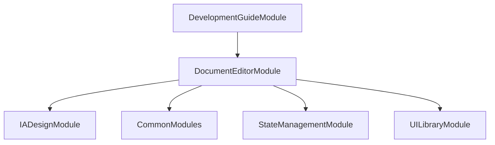

# FE-M006: DocumentEditorModule 상세 개발 설계서

## 1. 모듈 개요

### 1.1 모듈 식별 정보
- **모듈 ID**: FE-M006
- **모듈명**: DocumentEditorModule (개발 문서 편집)
- **담당 개발자**: 프론트엔드 개발자 (React/TypeScript + 에디터 전문)
- **예상 개발 기간**: 5일
- **우선순위**: P1 (중요)

### 1.2 모듈 목적 및 범위
- **핵심 기능**: 
  1. 5종 개발 문서 생성 및 편집 (프로젝트 명세서, 시스템 아키텍처, 기술 스택, ERD, API 명세서)
  2. 마크다운/리치텍스트 에디터
  3. 다이어그램 도구 (Mermaid)
  4. PDF/Word export 기능
  5. 문서 버전 관리 및 히스토리
- **비즈니스 가치**: 이전 단계의 모든 문서를 통합하여 개발팀이 필요로 하는 체계적인 개발 문서 생성 및 관리
- **제외 범위**: 실제 코드 생성, 다른 단계와의 직접적 데이터 연동, 사용자 권한 관리

### 1.3 목표 사용자
- **주 사용자 그룹**: 개발팀 리더, 시스템 아키텍트, 프로젝트 매니저
- **사용자 페르소나**: 개발 문서 작성 경험 3년 이상, 마크다운 및 다이어그램 도구 사용 능력 보유
- **사용 시나리오**: IA 디자인 완료 후 개발에 필요한 모든 문서를 체계적으로 작성 및 관리

---

## 2. 기술 아키텍처

### 2.1 모듈 구조
```
DocumentEditorModule/
├── components/
│   ├── DocumentEditor.tsx          # 메인 문서 에디터
│   ├── DocumentList.tsx            # 문서 목록
│   ├── DocumentViewer.tsx          # 문서 뷰어
│   ├── MarkdownEditor.tsx          # 마크다운 에디터
│   ├── RichTextEditor.tsx          # 리치텍스트 에디터
│   ├── DiagramEditor.tsx           # 다이어그램 에디터
│   ├── DocumentPreview.tsx         # 문서 미리보기
│   ├── VersionHistory.tsx          # 버전 히스토리
│   ├── ExportPanel.tsx             # 내보내기 패널
│   └── TemplateSelector.tsx        # 템플릿 선택기
├── hooks/
│   ├── useDocumentEditor.ts        # 문서 에디터 상태 관리
│   ├── useMarkdownEditor.ts        # 마크다운 에디터 로직
│   ├── useRichTextEditor.ts        # 리치텍스트 에디터 로직
│   ├── useDiagramEditor.ts         # 다이어그램 에디터 로직
│   ├── useDocumentHistory.ts       # 문서 히스토리 로직
│   └── useExport.ts                # 내보내기 로직
├── services/
│   ├── documentService.ts          # 문서 관리 서비스
│   ├── markdownService.ts          # 마크다운 처리 서비스
│   ├── diagramService.ts           # 다이어그램 서비스
│   ├── exportService.ts            # 내보내기 서비스
│   └── templateService.ts          # 템플릿 서비스
├── types/
│   ├── documentTypes.ts            # 문서 관련 타입 정의
│   ├── editorTypes.ts              # 에디터 타입 정의
│   └── exportTypes.ts              # 내보내기 타입 정의
├── utils/
│   ├── markdownUtils.ts            # 마크다운 유틸리티
│   ├── diagramUtils.ts             # 다이어그램 유틸리티
│   ├── exportUtils.ts              # 내보내기 유틸리티
│   └── templateUtils.ts            # 템플릿 유틸리티
├── templates/
│   ├── projectSpecification.md     # 프로젝트 명세서 템플릿
│   ├── systemArchitecture.md       # 시스템 아키텍처 템플릿
│   ├── techStack.md                # 기술 스택 템플릿
│   ├── erd.md                      # ERD 템플릿
│   └── apiSpecification.md         # API 명세서 템플릿
├── tests/
│   ├── DocumentEditor.test.tsx
│   ├── MarkdownEditor.test.tsx
│   └── ExportService.test.tsx
└── index.ts                        # 모듈 진입점
```

### 2.2 기술 스택
- **프레임워크**: React 18 + TypeScript
- **에디터**: Monaco Editor (마크다운), Tiptap (리치텍스트)
- **다이어그램**: Mermaid.js
- **상태관리**: Zustand (전역 상태) + React Hook (로컬 상태)
- **스타일링**: Tailwind CSS + Shadcn/ui
- **내보내기**: html-pdf, mammoth

---

## 3. 인터페이스 정의

### 3.1 외부 의존성
```typescript
interface ExternalDependencies {
  modules: [
    'FE-M005: IADesignModule',      // IA 디자인 데이터
    'FE-M008: CommonModules'        // 공통 UI 컴포넌트
  ];
  apis: [
    '/api/documents/save',          # 문서 저장 API
    '/api/documents/export',        # 문서 내보내기 API
    '/api/documents/templates'      # 문서 템플릿 API
  ];
  sharedComponents: [
    'Button', 'Input', 'Select', 'Tabs', 'Modal', 'Alert'
  ];
  utils: [
    'formatDate', 'generateId', 'validateMarkdown'
  ];
}
```

### 3.2 제공 인터페이스
```typescript
export interface DocumentEditorModuleInterface {
  components: {
    DocumentEditorModule: React.FC<DocumentEditorModuleProps>;
    DocumentEditor: React.FC<DocumentEditorProps>;
    MarkdownEditor: React.FC<MarkdownEditorProps>;
    RichTextEditor: React.FC<RichTextEditorProps>;
    DiagramEditor: React.FC<DiagramEditorProps>;
    DocumentPreview: React.FC<DocumentPreviewProps>;
  };
  
  hooks: {
    useDocumentEditor: () => DocumentEditorHook;
    useMarkdownEditor: () => MarkdownEditorHook;
    useRichTextEditor: () => RichTextEditorHook;
    useDiagramEditor: () => DiagramEditorHook;
    useExport: () => ExportHook;
  };
  
  services: {
    DocumentService: DocumentServiceClass;
    MarkdownService: MarkdownServiceClass;
    DiagramService: DiagramServiceClass;
    ExportService: ExportServiceClass;
  };
  
  types: {
    Document: DocumentType;
    DocumentTemplate: DocumentTemplateType;
    ExportFormat: ExportFormatType;
  };
}
```

---

## 4. 데이터 모델

### 4.1 엔티티 정의
```typescript
interface Document {
  id: string;
  projectId: string;
  type: DocumentType;
  title: string;
  content: string;
  format: DocumentFormat;
  template: string;
  version: number;
  isPublished: boolean;
  author: string;
  createdAt: Date;
  updatedAt: Date;
  publishedAt?: Date;
  history: DocumentVersion[];
}

interface DocumentVersion {
  id: string;
  documentId: string;
  version: number;
  content: string;
  changes: string;
  author: string;
  createdAt: Date;
}

interface DocumentType {
  id: 'project-specification' | 'system-architecture' | 'tech-stack' | 'erd' | 'api-specification';
  name: string;
  description: string;
  template: string;
  icon: string;
  color: string;
}

interface DocumentFormat {
  id: 'markdown' | 'richtext';
  name: string;
  description: string;
  editor: 'monaco' | 'tiptap';
}

interface DocumentTemplate {
  id: string;
  type: DocumentType['id'];
  name: string;
  description: string;
  content: string;
  variables: TemplateVariable[];
  isDefault: boolean;
  createdAt: Date;
  updatedAt: Date;
}

interface TemplateVariable {
  name: string;
  type: 'text' | 'select' | 'multiselect' | 'date' | 'number';
  required: boolean;
  defaultValue?: any;
  options?: string[];
  description: string;
}
```

### 4.2 상태 관리 스키마
```typescript
interface DocumentEditorState {
  documents: Document[];
  currentDocument: Document | null;
  selectedDocuments: string[];
  documentHistory: DocumentVersion[];
  templates: DocumentTemplate[];
  isEditing: boolean;
  isSaving: boolean;
  isExporting: boolean;
  autoSaveStatus: 'idle' | 'saving' | 'saved' | 'error';
  lastSavedAt: Date | null;
  exportProgress: number;
  
  actions: {
    createDocument: (type: DocumentType['id'], template?: string) => Document;
    updateDocument: (id: string, updates: Partial<Document>) => void;
    deleteDocument: (id: string) => void;
    selectDocument: (id: string) => void;
    selectDocuments: (ids: string[]) => void;
    clearSelection: () => void;
    saveDocument: (id: string) => Promise<void>;
    saveAllDocuments: () => Promise<void>;
    publishDocument: (id: string) => Promise<void>;
    createVersion: (id: string, changes: string) => void;
    restoreVersion: (documentId: string, version: number) => void;
    exportDocument: (id: string, format: string) => Promise<void>;
    exportAllDocuments: (format: string) => Promise<void>;
    loadTemplates: () => Promise<void>;
    applyTemplate: (documentId: string, templateId: string, variables: Record<string, any>) => void;
    resetDocument: () => void;
  };
}
```

---

## 5. 핵심 컴포넌트/서비스 명세

### 5.1 주요 컴포넌트 (Frontend)
```typescript
interface DocumentEditorProps {
  document: Document;
  onUpdate: (updates: Partial<Document>) => void;
  onSave: () => Promise<void>;
  onPublish: () => Promise<void>;
  onExport: (format: string) => Promise<void>;
  isSaving: boolean;
  autoSaveStatus: string;
}

const DocumentEditor: React.FC<DocumentEditorProps> = ({
  document,
  onUpdate,
  onSave,
  onPublish,
  onExport,
  isSaving,
  autoSaveStatus
}) => {
  // 메인 문서 에디터
  // 마크다운/리치텍스트 에디터 통합
  // 실시간 미리보기
  // 자동 저장 기능
};

interface MarkdownEditorProps {
  content: string;
  onChange: (content: string) => void;
  onSave: () => void;
  isReadOnly?: boolean;
  showPreview?: boolean;
  splitView?: boolean;
}

const MarkdownEditor: React.FC<MarkdownEditorProps> = ({
  content,
  onChange,
  onSave,
  isReadOnly,
  showPreview,
  splitView
}) => {
  // Monaco Editor 기반 마크다운 에디터
  // 구문 강조
  // 자동 완성
  // 실시간 미리보기
};

interface DiagramEditorProps {
  content: string;
  onChange: (content: string) => void;
  type: 'mermaid' | 'plantuml' | 'drawio';
  onPreview: (diagram: string) => void;
}

const DiagramEditor: React.FC<DiagramEditorProps> = ({
  content,
  onChange,
  type,
  onPreview
}) => {
  // 다이어그램 에디터
  // Mermaid.js 통합
  // 실시간 렌더링
  // 템플릿 제공
};
```

### 5.2 주요 서비스 (Backend)
```typescript
@Injectable()
export class DocumentService {
  constructor(
    private readonly repository: DocumentRepository,
    private readonly versionService: VersionService
  ) {}
  
  async saveDocument(document: Document): Promise<void> {
    // 문서 저장
    // 버전 관리
    // 자동 저장 처리
  }
  
  async createVersion(
    documentId: string,
    content: string,
    changes: string
  ): Promise<DocumentVersion> {
    // 문서 버전 생성
    // 변경 사항 추적
  }
  
  async getDocumentHistory(documentId: string): Promise<DocumentVersion[]> {
    // 문서 히스토리 조회
    // 버전별 비교
  }
}

@Injectable()
export class MarkdownService {
  constructor(
    private readonly parser: MarkdownParser,
    private readonly renderer: MarkdownRenderer
  ) {}
  
  async parseMarkdown(content: string): Promise<ParsedMarkdown> {
    // 마크다운 파싱
    // 구문 검증
    // 링크 검증
  }
  
  async renderToHTML(content: string): Promise<string> {
    // HTML 렌더링
    // 스타일 적용
    // 코드 하이라이팅
  }
}

@Injectable()
export class DiagramService {
  constructor(
    private readonly mermaidService: MermaidService
  ) {}
  
  async validateDiagram(content: string, type: string): Promise<ValidationResult> {
    // 다이어그램 유효성 검증
    // 구문 오류 검사
  }
  
  async renderDiagram(content: string, type: string): Promise<string> {
    // 다이어그램 렌더링
    // SVG 생성
  }
}

@Injectable()
export class ExportService {
  constructor(
    private readonly pdfService: PDFService,
    private readonly wordService: WordService
  ) {}
  
  async exportToPDF(document: Document): Promise<Blob> {
    // PDF 내보내기
    // 스타일 적용
    // 페이지 번호
  }
  
  async exportToWord(document: Document): Promise<Blob> {
    // Word 내보내기
    // 서식 보존
    // 테이블 처리
  }
  
  async exportAllDocuments(
    documents: Document[],
    format: string
  ): Promise<Blob> {
    // 전체 문서 내보내기
    // 목차 생성
    // 통합 파일 생성
  }
}
```

---

## 6. 이벤트 및 메시징

### 6.1 발행 이벤트
```typescript
enum DocumentEditorEvents {
  DOCUMENT_CREATED = 'documenteditor.document.created',
  DOCUMENT_UPDATED = 'documenteditor.document.updated',
  DOCUMENT_DELETED = 'documenteditor.document.deleted',
  DOCUMENT_SAVED = 'documenteditor.document.saved',
  DOCUMENT_PUBLISHED = 'documenteditor.document.published',
  DOCUMENT_EXPORTED = 'documenteditor.document.exported',
  VERSION_CREATED = 'documenteditor.version.created',
  VERSION_RESTORED = 'documenteditor.version.restored',
  TEMPLATE_APPLIED = 'documenteditor.template.applied',
  MODULE_COMPLETED = 'documenteditor.module.completed'
}
```

### 6.2 구독 이벤트
```typescript
interface SubscribedEvents {
  'iadesign.module.completed': (payload: IADesignCompletedPayload) => void;
  'project.deleted': (payload: ProjectDeletedPayload) => void;
  'user.logout': (payload: UserLogoutPayload) => void;
}
```

---

## 7. 에러 처리

### 7.1 에러 코드 정의
```typescript
enum DocumentEditorErrorCode {
  DOCUMENT_CREATE_FAILED = 'FE_M006_001',
  DOCUMENT_SAVE_FAILED = 'FE_M006_002',
  DOCUMENT_EXPORT_FAILED = 'FE_M006_003',
  MARKDOWN_PARSE_ERROR = 'FE_M006_004',
  DIAGRAM_RENDER_ERROR = 'FE_M006_005',
  TEMPLATE_APPLY_FAILED = 'FE_M006_006',
  VERSION_CREATE_FAILED = 'FE_M006_007',
  PROJECT_NOT_FOUND = 'FE_M006_008'
}
```

---

## 8. 테스트 전략

### 8.1 단위 테스트
```typescript
describe('DocumentEditorModule', () => {
  describe('MarkdownEditor', () => {
    it('should parse markdown correctly', () => {
      // 마크다운 파싱 테스트
    });
    
    it('should handle auto-save', async () => {
      // 자동 저장 테스트
    });
  });
  
  describe('DiagramEditor', () => {
    it('should render mermaid diagrams', () => {
      // 다이어그램 렌더링 테스트
    });
    
    it('should validate diagram syntax', () => {
      // 다이어그램 구문 검증 테스트
    });
  });
  
  describe('ExportService', () => {
    it('should export to PDF correctly', async () => {
      // PDF 내보내기 테스트
    });
    
    it('should export to Word correctly', async () => {
      // Word 내보내기 테스트
    });
  });
});
```

---

## 9. 성능 최적화

### 9.1 캐싱 전략
- **문서 캐싱**: 로드된 문서 메모리 캐싱
- **템플릿 캐싱**: 문서 템플릿 메모리 캐싱
- **렌더링 캐싱**: 마크다운/다이어그램 렌더링 결과 캐싱

### 9.2 최적화 기법
- **가상화**: 대량 문서 목록 가상 스크롤링
- **디바운싱**: 자동 저장 및 미리보기 디바운싱
- **지연 로딩**: 문서 내용 지연 로딩

---

## 10. 보안 고려사항

### 10.1 인증/인가
- **JWT 검증**: 모든 API 호출 시 토큰 검증
- **프로젝트 권한**: 프로젝트별 문서 접근 권한 체크

### 10.2 데이터 보호
- **입력 검증**: 마크다운/다이어그램 내용 XSS 방지
- **CSRF 보호**: 저장 요청 시 CSRF 토큰 검증

---

## 11. 배포 및 모니터링

### 11.1 환경 변수
```env
# 문서 에디터 관련 설정
VITE_AUTO_SAVE_INTERVAL=10000
VITE_MAX_DOCUMENT_SIZE_MB=50
VITE_MAX_VERSION_HISTORY=100
VITE_EXPORT_TIMEOUT=60000
```

### 11.2 로깅 및 모니터링
- **로그 레벨**: Debug/Info/Warn/Error
- **메트릭**: 문서 생성/편집 빈도, 내보내기 성공률, 자동 저장 성공률
- **알림**: 저장 실패, 내보내기 실패, 버전 생성 오류

---

## 12. 개발 가이드라인

### 12.1 코딩 컨벤션
- **네이밍**: camelCase (변수), PascalCase (컴포넌트/클래스)
- **파일 구조**: 기능별 그룹핑, 명확한 import/export
- **주석**: JSDoc 형식, 복잡한 에디터 로직 설명

### 12.2 Git 브랜치 전략
```
main
├── develop
│   ├── feature/FE-M006-markdown-editor
│   ├── feature/FE-M006-diagram-editor
│   └── fix/FE-M006-export-bug
```

### 12.3 PR 체크리스트
- [ ] 단위 테스트 통과
- [ ] 코드 리뷰 승인
- [ ] 마크다운 에디터 테스트
- [ ] 다이어그램 에디터 테스트
- [ ] 내보내기 기능 테스트
- [ ] 버전 관리 테스트
- [ ] 성능 영향 검토

---

## 13. 의존성 그래프



---

이 설계서는 DocumentEditorModule의 독립적인 개발을 위한 완전한 가이드를 제공하며, 마크다운/리치텍스트 에디터와 다이어그램 도구를 중심으로 체계적인 개발 문서 작성 및 관리를 지원합니다.
