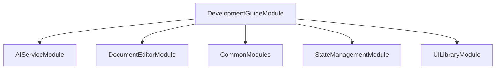

# FE-M007: DevelopmentGuideModule 상세 개발 설계서

## 1. 모듈 개요

### 1.1 모듈 식별 정보
- **모듈 ID**: FE-M007
- **모듈명**: DevelopmentGuideModule (개발 가이드 생성)
- **담당 개발자**: 프론트엔드 개발자 (React/TypeScript + 코드 생성 전문)
- **예상 개발 기간**: 4일
- **우선순위**: P1 (중요)

### 1.2 모듈 목적 및 범위
- **핵심 기능**: 
  1. 모든 이전 단계 문서 통합 분석
  2. 화면별 컴포넌트 명세 생성
  3. 코드 템플릿 생성 (React, API, 테스트)
  4. 데이터베이스 가이드 및 Cursor IDE 연동 파일 생성
  5. 프로젝트 구조 및 설정 파일 생성
- **비즈니스 가치**: 모든 단계의 문서를 통합하여 Cursor IDE에서 바로 사용할 수 있는 완전한 개발 가이드와 코드 템플릿 제공
- **제외 범위**: 실제 코드 실행, 외부 시스템 연동, 다른 단계와의 직접적 데이터 연동

### 1.3 목표 사용자
- **주 사용자 그룹**: 개발자, 개발팀 리더, 시스템 아키텍트
- **사용자 페르소나**: React/Node.js 개발 경험 3년 이상, Cursor IDE 사용 능력 보유
- **사용 시나리오**: 모든 단계 완료 후 Cursor IDE에서 바로 개발을 시작할 수 있는 완전한 프로젝트 환경 구성

---

## 2. 기술 아키텍처

### 2.1 모듈 구조
```
DevelopmentGuideModule/
├── components/
│   ├── DevelopmentGuide.tsx        # 메인 개발 가이드 컴포넌트
│   ├── CodeGenerator.tsx           # 코드 생성 컴포넌트
│   ├── ComponentSpecs.tsx          # 컴포넌트 명세 표시
│   ├── CodeTemplates.tsx           # 코드 템플릿 표시
│   ├── DatabaseGuide.tsx           # 데이터베이스 가이드
│   ├── ProjectStructure.tsx        # 프로젝트 구조 표시
│   ├── CursorIntegration.tsx       # Cursor IDE 연동
│   ├── CodeEditor.tsx              # 코드 에디터
│   └── DownloadPanel.tsx           # 다운로드 패널
├── hooks/
│   ├── useDevelopmentGuide.ts      # 개발 가이드 상태 관리
│   ├── useCodeGeneration.ts        # 코드 생성 로직
│   ├── useComponentSpecs.ts        # 컴포넌트 명세 로직
│   ├── useCodeTemplates.ts         # 코드 템플릿 로직
│   └── useCursorIntegration.ts     # Cursor 연동 로직
├── services/
│   ├── developmentGuideService.ts  # 개발 가이드 서비스
│   ├── codeGenerationService.ts    # 코드 생성 서비스
│   ├── componentSpecService.ts     # 컴포넌트 명세 서비스
│   ├── templateService.ts          # 템플릿 서비스
│   └── cursorIntegrationService.ts # Cursor 연동 서비스
├── types/
│   ├── developmentGuideTypes.ts    # 개발 가이드 타입 정의
│   ├── componentSpecTypes.ts       # 컴포넌트 명세 타입 정의
│   ├── codeTemplateTypes.ts        # 코드 템플릿 타입 정의
│   └── cursorTypes.ts              # Cursor 연동 타입 정의
├── utils/
│   ├── codeGenerationUtils.ts      # 코드 생성 유틸리티
│   ├── templateUtils.ts            # 템플릿 유틸리티
│   ├── fileUtils.ts                # 파일 유틸리티
│   └── cursorUtils.ts              # Cursor 유틸리티
├── templates/
│   ├── react/
│   │   ├── component.tsx.template
│   │   ├── hook.ts.template
│   │   ├── service.ts.template
│   │   └── test.tsx.template
│   ├── api/
│   │   ├── controller.ts.template
│   │   ├── service.ts.template
│   │   ├── dto.ts.template
│   │   └── test.ts.template
│   ├── database/
│   │   ├── schema.sql.template
│   │   ├── migration.sql.template
│   │   └── seed.sql.template
│   └── config/
│       ├── package.json.template
│       ├── tsconfig.json.template
│       └── .cursorrules.template
├── generators/
│   ├── ReactComponentGenerator.ts   # React 컴포넌트 생성기
│   ├── APIGenerator.ts              # API 생성기
│   ├── DatabaseGenerator.ts         # 데이터베이스 생성기
│   └── ProjectGenerator.ts          # 프로젝트 생성기
├── tests/
│   ├── DevelopmentGuide.test.tsx
│   ├── CodeGeneration.test.tsx
│   └── CursorIntegration.test.tsx
└── index.ts                        # 모듈 진입점
```

### 2.2 기술 스택
- **프레임워크**: React 18 + TypeScript
- **코드 에디터**: Monaco Editor
- **상태관리**: Zustand (전역 상태) + React Hook (로컬 상태)
- **스타일링**: Tailwind CSS + Shadcn/ui
- **파일 처리**: JSZip (압축), FileSaver (다운로드)

---

## 3. 인터페이스 정의

### 3.1 외부 의존성
```typescript
interface ExternalDependencies {
  modules: [
    'SH-M001: AIServiceModule',     // AI 코드 생성 서비스
    'FE-M006: DocumentEditorModule', // 개발 문서 데이터
    'FE-M008: CommonModules'        // 공통 UI 컴포넌트
  ];
  apis: [
    '/api/development-guide/generate', # 개발 가이드 생성 API
    '/api/code-templates/generate',    # 코드 템플릿 생성 API
    '/api/cursor-integration/generate' # Cursor 연동 생성 API
  ];
  sharedComponents: [
    'Button', 'Input', 'Select', 'Tabs', 'Modal', 'Alert', 'CodeEditor'
  ];
  utils: [
    'formatCode', 'validateTemplate', 'generateId'
  ];
}
```

### 3.2 제공 인터페이스
```typescript
export interface DevelopmentGuideModuleInterface {
  components: {
    DevelopmentGuideModule: React.FC<DevelopmentGuideModuleProps>;
    DevelopmentGuide: React.FC<DevelopmentGuideProps>;
    CodeGenerator: React.FC<CodeGeneratorProps>;
    ComponentSpecs: React.FC<ComponentSpecsProps>;
    CodeTemplates: React.FC<CodeTemplatesProps>;
    CursorIntegration: React.FC<CursorIntegrationProps>;
  };
  
  hooks: {
    useDevelopmentGuide: () => DevelopmentGuideHook;
    useCodeGeneration: () => CodeGenerationHook;
    useComponentSpecs: () => ComponentSpecsHook;
    useCodeTemplates: () => CodeTemplatesHook;
    useCursorIntegration: () => CursorIntegrationHook;
  };
  
  services: {
    DevelopmentGuideService: DevelopmentGuideServiceClass;
    CodeGenerationService: CodeGenerationServiceClass;
    ComponentSpecService: ComponentSpecServiceClass;
    TemplateService: TemplateServiceClass;
  };
  
  types: {
    DevelopmentGuide: DevelopmentGuideType;
    ComponentSpec: ComponentSpecType;
    CodeTemplate: CodeTemplateType;
    CursorProject: CursorProjectType;
  };
}
```

---

## 4. 데이터 모델

### 4.1 엔티티 정의
```typescript
interface DevelopmentGuide {
  id: string;
  projectId: string;
  title: string;
  description: string;
  componentSpecs: ComponentSpec[];
  codeTemplates: CodeTemplate[];
  databaseGuide: DatabaseGuide;
  projectStructure: ProjectStructure;
  cursorProject: CursorProject;
  generatedAt: Date;
  version: string;
}

interface ComponentSpec {
  id: string;
  name: string;
  type: 'screen' | 'component' | 'layout';
  description: string;
  props: ComponentProp[];
  state: ComponentState[];
  methods: ComponentMethod[];
  styles: ComponentStyle[];
  dependencies: string[];
  iACode: string;
  relatedRequirements: string[];
}

interface ComponentProp {
  name: string;
  type: string;
  required: boolean;
  defaultValue?: any;
  description: string;
}

interface CodeTemplate {
  id: string;
  name: string;
  type: 'react' | 'api' | 'database' | 'config';
  category: string;
  content: string;
  variables: TemplateVariable[];
  dependencies: string[];
  description: string;
}

interface DatabaseGuide {
  entities: DatabaseEntity[];
  relationships: DatabaseRelationship[];
  migrations: DatabaseMigration[];
  seeds: DatabaseSeed[];
  indexes: DatabaseIndex[];
  constraints: DatabaseConstraint[];
}

interface ProjectStructure {
  directories: ProjectDirectory[];
  files: ProjectFile[];
  configurations: ProjectConfiguration[];
  scripts: ProjectScript[];
}

interface CursorProject {
  files: CursorFile[];
  configurations: CursorConfiguration[];
  rules: CursorRule[];
  prompts: CursorPrompt[];
}
```

### 4.2 상태 관리 스키마
```typescript
interface DevelopmentGuideState {
  developmentGuide: DevelopmentGuide | null;
  componentSpecs: ComponentSpec[];
  codeTemplates: CodeTemplate[];
  selectedTemplate: CodeTemplate | null;
  isGenerating: boolean;
  isDownloading: boolean;
  generationProgress: number;
  downloadProgress: number;
  generatedFiles: GeneratedFile[];
  
  actions: {
    generateDevelopmentGuide: () => Promise<void>;
    generateComponentSpecs: () => Promise<void>;
    generateCodeTemplates: () => Promise<void>;
    generateDatabaseGuide: () => Promise<void>;
    generateProjectStructure: () => Promise<void>;
    generateCursorProject: () => Promise<void>;
    selectTemplate: (template: CodeTemplate) => void;
    editTemplate: (templateId: string, content: string) => void;
    downloadProject: () => Promise<void>;
    downloadTemplate: (templateId: string) => Promise<void>;
    copyToClipboard: (content: string) => void;
    resetDevelopmentGuide: () => void;
  };
}
```

---

## 5. 핵심 컴포넌트/서비스 명세

### 5.1 주요 컴포넌트 (Frontend)
```typescript
interface DevelopmentGuideProps {
  projectData: ProjectData;
  onComplete: (guide: DevelopmentGuide) => void;
  onBack: () => void;
}

const DevelopmentGuide: React.FC<DevelopmentGuideProps> = ({
  projectData,
  onComplete,
  onBack
}) => {
  // 메인 개발 가이드 컴포넌트
  // 모든 이전 단계 데이터 통합
  // 코드 생성 및 다운로드 기능
};

interface CodeGeneratorProps {
  componentSpecs: ComponentSpec[];
  onGenerate: () => Promise<void>;
  onDownload: () => Promise<void>;
  isGenerating: boolean;
  progress: number;
}

const CodeGenerator: React.FC<CodeGeneratorProps> = ({
  componentSpecs,
  onGenerate,
  onDownload,
  isGenerating,
  progress
}) => {
  // 코드 생성 컴포넌트
  // 진행률 표시
  // 생성 상태 관리
};

interface ComponentSpecsProps {
  specs: ComponentSpec[];
  onSpecSelect: (spec: ComponentSpec) => void;
  selectedSpec: ComponentSpec | null;
}

const ComponentSpecs: React.FC<ComponentSpecsProps> = ({
  specs,
  onSpecSelect,
  selectedSpec
}) => {
  // 컴포넌트 명세 표시
  // 상세 정보 보기
  // 관련 요구사항 연결
};

interface CodeTemplatesProps {
  templates: CodeTemplate[];
  onTemplateSelect: (template: CodeTemplate) => void;
  onTemplateEdit: (templateId: string, content: string) => void;
  selectedTemplate: CodeTemplate | null;
}

const CodeTemplates: React.FC<CodeTemplatesProps> = ({
  templates,
  onTemplateSelect,
  onTemplateEdit,
  selectedTemplate
}) => {
  // 코드 템플릿 표시
  // 템플릿 편집
  // 코드 미리보기
};

interface CursorIntegrationProps {
  cursorProject: CursorProject;
  onDownload: () => Promise<void>;
  onCopyRules: () => void;
  onCopyPrompts: () => void;
}

const CursorIntegration: React.FC<CursorIntegrationProps> = ({
  cursorProject,
  onDownload,
  onCopyRules,
  onCopyPrompts
}) => {
  // Cursor IDE 연동 컴포넌트
  // 프로젝트 파일 생성
  // 설정 파일 다운로드
};
```

### 5.2 주요 서비스 (Backend)
```typescript
@Injectable()
export class DevelopmentGuideService {
  constructor(
    private readonly aiService: AIService,
    private readonly templateService: TemplateService
  ) {}
  
  async generateDevelopmentGuide(
    projectData: ProjectData
  ): Promise<DevelopmentGuide> {
    // 개발 가이드 통합 생성
    // 모든 단계 데이터 분석
    // 일관성 검증
  }
  
  async validateDevelopmentGuide(
    guide: DevelopmentGuide
  ): Promise<ValidationResult> {
    // 개발 가이드 유효성 검증
    // 코드 템플릿 검증
    // 의존성 검사
  }
}

@Injectable()
export class CodeGenerationService {
  constructor(
    private readonly aiService: AIService,
    private readonly templateEngine: TemplateEngine
  ) {}
  
  async generateComponentSpecs(
    iaDesign: IADesign,
    requirements: Requirement[]
  ): Promise<ComponentSpec[]> {
    // 컴포넌트 명세 생성
    // Props, State, Methods 정의
    // 의존성 분석
  }
  
  async generateCodeTemplates(
    componentSpecs: ComponentSpec[]
  ): Promise<CodeTemplate[]> {
    // 코드 템플릿 생성
    // React 컴포넌트
    // API 서비스
    // 테스트 코드
  }
  
  async generateDatabaseGuide(
    requirements: Requirement[]
  ): Promise<DatabaseGuide> {
    // 데이터베이스 가이드 생성
    // 엔티티 정의
    // 관계 설정
    // 마이그레이션
  }
}

@Injectable()
export class CursorIntegrationService {
  constructor(
    private readonly fileService: FileService,
    private readonly zipService: ZipService
  ) {}
  
  async generateCursorProject(
    developmentGuide: DevelopmentGuide
  ): Promise<CursorProject> {
    // Cursor 프로젝트 생성
    // .cursorrules 파일
    // 프로젝트 설정
    // 프롬프트 파일
  }
  
  async createProjectZip(
    cursorProject: CursorProject
  ): Promise<Blob> {
    // 프로젝트 ZIP 파일 생성
    // 모든 파일 포함
    // 설정 파일 포함
  }
}
```

---

## 6. 이벤트 및 메시징

### 6.1 발행 이벤트
```typescript
enum DevelopmentGuideEvents {
  DEVELOPMENT_GUIDE_GENERATED = 'developmentguide.generated',
  COMPONENT_SPECS_GENERATED = 'developmentguide.component-specs.generated',
  CODE_TEMPLATES_GENERATED = 'developmentguide.code-templates.generated',
  DATABASE_GUIDE_GENERATED = 'developmentguide.database-guide.generated',
  CURSOR_PROJECT_GENERATED = 'developmentguide.cursor-project.generated',
  PROJECT_DOWNLOADED = 'developmentguide.project.downloaded',
  TEMPLATE_EDITED = 'developmentguide.template.edited',
  MODULE_COMPLETED = 'developmentguide.module.completed'
}
```

### 6.2 구독 이벤트
```typescript
interface SubscribedEvents {
  'documenteditor.module.completed': (payload: DocumentEditorCompletedPayload) => void;
  'project.deleted': (payload: ProjectDeletedPayload) => void;
  'user.logout': (payload: UserLogoutPayload) => void;
}
```

---

## 7. 에러 처리

### 7.1 에러 코드 정의
```typescript
enum DevelopmentGuideErrorCode {
  GENERATION_FAILED = 'FE_M007_001',
  AI_SERVICE_ERROR = 'FE_M007_002',
  TEMPLATE_ERROR = 'FE_M007_003',
  CODE_VALIDATION_ERROR = 'FE_M007_004',
  DOWNLOAD_FAILED = 'FE_M007_005',
  CURSOR_INTEGRATION_ERROR = 'FE_M007_006',
  PROJECT_NOT_FOUND = 'FE_M007_007'
}
```

---

## 8. 테스트 전략

### 8.1 단위 테스트
```typescript
describe('DevelopmentGuideModule', () => {
  describe('CodeGenerationService', () => {
    it('should generate component specs correctly', async () => {
      // 컴포넌트 명세 생성 테스트
    });
    
    it('should generate code templates', async () => {
      // 코드 템플릿 생성 테스트
    });
  });
  
  describe('CursorIntegrationService', () => {
    it('should generate cursor project files', async () => {
      // Cursor 프로젝트 생성 테스트
    });
    
    it('should create project zip file', async () => {
      // 프로젝트 ZIP 생성 테스트
    });
  });
});
```

---

## 9. 성능 최적화

### 9.1 캐싱 전략
- **템플릿 캐싱**: 코드 템플릿 메모리 캐싱
- **생성 결과 캐싱**: 생성된 코드 결과 메모리 캐싱

### 9.2 최적화 기법
- **지연 로딩**: 대량 템플릿 지연 로딩
- **스트리밍**: 대용량 파일 다운로드 스트리밍

---

## 10. 보안 고려사항

### 10.1 인증/인가
- **JWT 검증**: 모든 API 호출 시 토큰 검증
- **프로젝트 권한**: 프로젝트별 개발 가이드 접근 권한 체크

### 10.2 데이터 보호
- **코드 검증**: 생성된 코드 보안 검증
- **CSRF 보호**: 다운로드 요청 시 CSRF 토큰 검증

---

## 11. 배포 및 모니터링

### 11.1 환경 변수
```env
# 개발 가이드 관련 설정
VITE_CODE_GENERATION_TIMEOUT=120000
VITE_MAX_FILE_SIZE_MB=100
VITE_DOWNLOAD_TIMEOUT=300000
```

### 11.2 로깅 및 모니터링
- **로그 레벨**: Debug/Info/Warn/Error
- **메트릭**: 코드 생성 성공률, 다운로드 성공률, 템플릿 사용률
- **알림**: 생성 실패, 다운로드 실패, AI 서비스 오류

---

## 12. 개발 가이드라인

### 12.1 코딩 컨벤션
- **네이밍**: camelCase (변수), PascalCase (컴포넌트/클래스)
- **파일 구조**: 기능별 그룹핑, 명확한 import/export
- **주석**: JSDoc 형식, 복잡한 코드 생성 로직 설명

### 12.2 Git 브랜치 전략
```
main
├── develop
│   ├── feature/FE-M007-code-generation
│   ├── feature/FE-M007-cursor-integration
│   └── fix/FE-M007-template-bug
```

### 12.3 PR 체크리스트
- [ ] 단위 테스트 통과
- [ ] 코드 리뷰 승인
- [ ] 코드 생성 시나리오 테스트
- [ ] Cursor 연동 테스트
- [ ] 다운로드 기능 테스트
- [ ] 템플릿 편집 테스트
- [ ] 성능 영향 검토

---

## 13. 의존성 그래프



---

이 설계서는 DevelopmentGuideModule의 독립적인 개발을 위한 완전한 가이드를 제공하며, AI 기반 코드 생성과 Cursor IDE 연동을 중심으로 완전한 개발 환경을 제공합니다.
