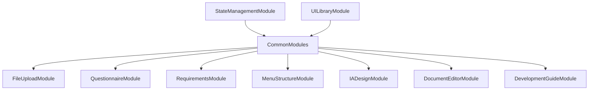

# FE-M008: CommonModules 상세 개발 설계서

## 1. 모듈 개요

### 1.1 모듈 식별 정보
- **모듈 ID**: FE-M008
- **모듈명**: CommonModules (공통 모듈들)
- **담당 개발자**: 프론트엔드 개발자 (React/TypeScript + 공통 컴포넌트 전문)
- **예상 개발 기간**: 2일
- **우선순위**: P0 (필수)

### 1.2 모듈 목적 및 범위
- **핵심 기능**: 
  1. 7단계 워크플로우 진행 상태 추적
  2. 단계별 네비게이션 및 라우팅
  3. 자동 저장 및 데이터 동기화
  4. 공통 UI 컴포넌트 및 유틸리티
  5. 에러 처리 및 알림 시스템
- **비즈니스 가치**: 모든 워크플로우 단계에서 공통으로 사용되는 기능들을 통합하여 일관된 사용자 경험과 개발 효율성 제공
- **제외 범위**: 특정 단계별 비즈니스 로직, 외부 시스템 연동, 사용자 인증

### 1.3 목표 사용자
- **주 사용자 그룹**: 모든 워크플로우 단계 사용자
- **사용자 페르소나**: SI 프로젝트 관리 경험 2년 이상, 웹 기반 도구 사용 능력 보유
- **사용 시나리오**: 프로젝트 시작부터 완료까지 일관된 네비게이션과 상태 관리 경험

---

## 2. 기술 아키텍처

### 2.1 모듈 구조
```
CommonModules/
├── components/
│   ├── StepNavigation.tsx          # 단계별 네비게이션
│   ├── PhaseTracker.tsx            # 진행 상태 추적
│   ├── ProgressBar.tsx             # 진행률 표시
│   ├── AutoSaveIndicator.tsx       # 자동 저장 표시
│   ├── ErrorBoundary.tsx           # 에러 바운더리
│   ├── NotificationSystem.tsx      # 알림 시스템
│   ├── LoadingSpinner.tsx          # 로딩 스피너
│   ├── ConfirmDialog.tsx           # 확인 다이얼로그
│   ├── ToastNotification.tsx       # 토스트 알림
│   └── HelpTooltip.tsx             # 도움말 툴팁
├── hooks/
│   ├── useStepNavigation.ts        # 단계 네비게이션 로직
│   ├── useProgressTracking.ts      # 진행률 추적 로직
│   ├── useAutoSave.ts              # 자동 저장 로직
│   ├── useErrorHandling.ts         # 에러 처리 로직
│   ├── useNotifications.ts         # 알림 관리 로직
│   ├── useLocalStorage.ts          # 로컬 스토리지 로직
│   └── useKeyboardShortcuts.ts     # 키보드 단축키 로직
├── services/
│   ├── navigationService.ts        # 네비게이션 서비스
│   ├── progressService.ts          # 진행률 서비스
│   ├── autoSaveService.ts          # 자동 저장 서비스
│   ├── errorService.ts             # 에러 처리 서비스
│   ├── notificationService.ts      # 알림 서비스
│   └── storageService.ts           # 스토리지 서비스
├── types/
│   ├── commonTypes.ts              # 공통 타입 정의
│   ├── navigationTypes.ts          # 네비게이션 타입 정의
│   ├── progressTypes.ts            # 진행률 타입 정의
│   └── errorTypes.ts               # 에러 타입 정의
├── utils/
│   ├── navigationUtils.ts          # 네비게이션 유틸리티
│   ├── progressUtils.ts            # 진행률 유틸리티
│   ├── storageUtils.ts             # 스토리지 유틸리티
│   ├── errorUtils.ts               # 에러 유틸리티
│   ├── validationUtils.ts          # 검증 유틸리티
│   └── formatUtils.ts              # 포맷 유틸리티
├── constants/
│   ├── steps.ts                    # 단계 상수 정의
│   ├── routes.ts                   # 라우트 상수 정의
│   ├── messages.ts                 # 메시지 상수 정의
│   └── config.ts                   # 설정 상수 정의
├── styles/
│   ├── globals.css                 # 전역 스타일
│   ├── components.css              # 컴포넌트 스타일
│   └── animations.css              # 애니메이션 스타일
├── tests/
│   ├── StepNavigation.test.tsx
│   ├── ProgressTracking.test.tsx
│   └── AutoSave.test.tsx
└── index.ts                        # 모듈 진입점
```

### 2.2 기술 스택
- **프레임워크**: React 18 + TypeScript
- **라우팅**: React Router v6
- **상태관리**: Zustand
- **스타일링**: Tailwind CSS + Shadcn/ui
- **스토리지**: localStorage + IndexedDB
- **알림**: React Hot Toast

---

## 3. 인터페이스 정의

### 3.1 외부 의존성
```typescript
interface ExternalDependencies {
  modules: [
    'FE-M001: FileUploadModule',
    'FE-M002: QuestionnaireModule',
    'FE-M003: RequirementsModule',
    'FE-M004: MenuStructureModule',
    'FE-M005: IADesignModule',
    'FE-M006: DocumentEditorModule',
    'FE-M007: DevelopmentGuideModule'
  ];
  apis: [
    '/api/projects/{id}/progress',   # 진행률 API
    '/api/projects/{id}/autosave',   # 자동 저장 API
    '/api/projects/{id}/navigation'  # 네비게이션 API
  ];
  sharedComponents: [
    'Button', 'Input', 'Select', 'Modal', 'Alert', 'Progress', 'Badge'
  ];
  utils: [
    'formatDate', 'generateId', 'validateData'
  ];
}
```

### 3.2 제공 인터페이스
```typescript
export interface CommonModulesInterface {
  components: {
    StepNavigation: React.FC<StepNavigationProps>;
    PhaseTracker: React.FC<PhaseTrackerProps>;
    ProgressBar: React.FC<ProgressBarProps>;
    AutoSaveIndicator: React.FC<AutoSaveIndicatorProps>;
    ErrorBoundary: React.FC<ErrorBoundaryProps>;
    NotificationSystem: React.FC<NotificationSystemProps>;
  };
  
  hooks: {
    useStepNavigation: () => StepNavigationHook;
    useProgressTracking: () => ProgressTrackingHook;
    useAutoSave: () => AutoSaveHook;
    useErrorHandling: () => ErrorHandlingHook;
    useNotifications: () => NotificationsHook;
  };
  
  services: {
    NavigationService: NavigationServiceClass;
    ProgressService: ProgressServiceClass;
    AutoSaveService: AutoSaveServiceClass;
    ErrorService: ErrorServiceClass;
    NotificationService: NotificationServiceClass;
  };
  
  types: {
    Step: StepType;
    Progress: ProgressType;
    AutoSaveStatus: AutoSaveStatusType;
    ErrorInfo: ErrorInfoType;
  };
}
```

---

## 4. 데이터 모델

### 4.1 엔티티 정의
```typescript
interface Step {
  id: string;
  number: number;
  name: string;
  title: string;
  description: string;
  route: string;
  status: StepStatus;
  isAccessible: boolean;
  completedAt?: Date;
  estimatedTime: number; // 분 단위
  dependencies: string[];
}

interface StepStatus {
  id: 'pending' | 'in-progress' | 'completed' | 'error' | 'disabled';
  name: string;
  color: string;
  icon: string;
}

interface Progress {
  projectId: string;
  currentStep: string;
  completedSteps: string[];
  totalSteps: number;
  completionRate: number;
  estimatedTimeRemaining: number;
  lastUpdatedAt: Date;
  milestones: Milestone[];
}

interface Milestone {
  id: string;
  stepId: string;
  name: string;
  description: string;
  achievedAt: Date;
  reward?: string;
}

interface AutoSaveStatus {
  isEnabled: boolean;
  interval: number; // 밀리초
  lastSavedAt: Date | null;
  isSaving: boolean;
  hasUnsavedChanges: boolean;
  error: string | null;
}

interface ErrorInfo {
  id: string;
  code: string;
  message: string;
  details?: string;
  stack?: string;
  timestamp: Date;
  stepId?: string;
  userId?: string;
  resolved: boolean;
}
```

### 4.2 상태 관리 스키마
```typescript
interface CommonModulesState {
  currentStep: string;
  steps: Step[];
  progress: Progress | null;
  autoSaveStatus: AutoSaveStatus;
  errors: ErrorInfo[];
  notifications: Notification[];
  isLoading: boolean;
  keyboardShortcuts: KeyboardShortcut[];
  
  actions: {
    navigateToStep: (stepId: string) => void;
    navigateNext: () => void;
    navigatePrevious: () => void;
    updateStepStatus: (stepId: string, status: StepStatus['id']) => void;
    completeStep: (stepId: string) => void;
    updateProgress: (progress: Partial<Progress>) => void;
    enableAutoSave: () => void;
    disableAutoSave: () => void;
    saveData: (data: any) => Promise<void>;
    addError: (error: ErrorInfo) => void;
    resolveError: (errorId: string) => void;
    clearErrors: () => void;
    showNotification: (notification: Omit<Notification, 'id'>) => void;
    hideNotification: (notificationId: string) => void;
    clearNotifications: () => void;
    setLoading: (loading: boolean) => void;
    registerKeyboardShortcut: (shortcut: KeyboardShortcut) => void;
    unregisterKeyboardShortcut: (key: string) => void;
    resetState: () => void;
  };
}
```

---

## 5. 핵심 컴포넌트/서비스 명세

### 5.1 주요 컴포넌트 (Frontend)
```typescript
interface StepNavigationProps {
  currentStep: string;
  steps: Step[];
  onStepSelect: (stepId: string) => void;
  onNext: () => void;
  onPrevious: () => void;
  isNavigating: boolean;
}

const StepNavigation: React.FC<StepNavigationProps> = ({
  currentStep,
  steps,
  onStepSelect,
  onNext,
  onPrevious,
  isNavigating
}) => {
  // 단계별 네비게이션 컴포넌트
  // 진행 상태 표시
  // 접근 권한 체크
  // 키보드 네비게이션 지원
};

interface PhaseTrackerProps {
  progress: Progress;
  steps: Step[];
  onStepClick: (stepId: string) => void;
}

const PhaseTracker: React.FC<PhaseTrackerProps> = ({
  progress,
  steps,
  onStepClick
}) => {
  // 7단계 진행 상태 추적
  // 시각적 진행률 표시
  // 마일스톤 표시
};

interface AutoSaveIndicatorProps {
  status: AutoSaveStatus;
  onManualSave: () => void;
  onToggleAutoSave: () => void;
}

const AutoSaveIndicator: React.FC<AutoSaveIndicatorProps> = ({
  status,
  onManualSave,
  onToggleAutoSave
}) => {
  // 자동 저장 상태 표시
  // 수동 저장 버튼
  // 설정 토글
};

interface ErrorBoundaryProps {
  children: React.ReactNode;
  fallback?: React.ComponentType<ErrorFallbackProps>;
  onError?: (error: Error, errorInfo: ErrorInfo) => void;
}

const ErrorBoundary: React.FC<ErrorBoundaryProps> = ({
  children,
  fallback,
  onError
}) => {
  // 에러 바운더리 컴포넌트
  // 에러 캐치 및 복구
  // 에러 리포팅
};
```

### 5.2 주요 서비스 (Backend)
```typescript
@Injectable()
export class NavigationService {
  constructor(
    private readonly router: Router,
    private readonly storageService: StorageService
  ) {}
  
  async navigateToStep(stepId: string): Promise<void> {
    // 단계 네비게이션
    // 접근 권한 체크
    // 히스토리 관리
  }
  
  async validateStepAccess(stepId: string): Promise<boolean> {
    // 단계 접근 권한 검증
    // 의존성 체크
  }
  
  async getNavigationHistory(): Promise<NavigationHistory[]> {
    // 네비게이션 히스토리 조회
  }
}

@Injectable()
export class ProgressService {
  constructor(
    private readonly repository: ProgressRepository,
    private readonly eventService: EventService
  ) {}
  
  async updateProgress(
    projectId: string,
    progress: Partial<Progress>
  ): Promise<void> {
    // 진행률 업데이트
    // 마일스톤 체크
    // 이벤트 발행
  }
  
  async calculateCompletionRate(
    completedSteps: string[],
    totalSteps: number
  ): Promise<number> {
    // 완성률 계산
    // 가중치 적용
  }
  
  async estimateTimeRemaining(
    progress: Progress
  ): Promise<number> {
    // 남은 시간 추정
    // 단계별 예상 시간 기반
  }
}

@Injectable()
export class AutoSaveService {
  constructor(
    private readonly storageService: StorageService,
    private readonly apiService: ApiService
  ) {}
  
  async enableAutoSave(
    projectId: string,
    interval: number = 30000
  ): Promise<void> {
    // 자동 저장 활성화
    // 타이머 설정
    // 변경 감지 시작
  }
  
  async saveData(
    projectId: string,
    data: any
  ): Promise<void> {
    // 데이터 저장
    // 로컬 스토리지 백업
    // 서버 동기화
  }
  
  async restoreData(projectId: string): Promise<any> {
    // 데이터 복원
    // 충돌 해결
  }
}

@Injectable()
export class ErrorService {
  constructor(
    private readonly logger: Logger,
    private readonly notificationService: NotificationService
  ) {}
  
  async handleError(
    error: Error,
    context: ErrorContext
  ): Promise<void> {
    // 에러 처리
    // 로깅
    // 사용자 알림
  }
  
  async reportError(errorInfo: ErrorInfo): Promise<void> {
    // 에러 리포팅
    // 서버 전송
  }
}
```

---

## 6. 이벤트 및 메시징

### 6.1 발행 이벤트
```typescript
enum CommonModulesEvents {
  STEP_CHANGED = 'common.step.changed',
  PROGRESS_UPDATED = 'common.progress.updated',
  STEP_COMPLETED = 'common.step.completed',
  AUTO_SAVE_ENABLED = 'common.autosave.enabled',
  AUTO_SAVE_DISABLED = 'common.autosave.disabled',
  DATA_SAVED = 'common.data.saved',
  ERROR_OCCURRED = 'common.error.occurred',
  ERROR_RESOLVED = 'common.error.resolved',
  NOTIFICATION_SHOWN = 'common.notification.shown',
  KEYBOARD_SHORTCUT_USED = 'common.keyboard.shortcut.used'
}
```

### 6.2 구독 이벤트
```typescript
interface SubscribedEvents {
  'project.created': (payload: ProjectCreatedPayload) => void;
  'project.deleted': (payload: ProjectDeletedPayload) => void;
  'user.logout': (payload: UserLogoutPayload) => void;
  'module.completed': (payload: ModuleCompletedPayload) => void;
}
```

---

## 7. 에러 처리

### 7.1 에러 코드 정의
```typescript
enum CommonModulesErrorCode {
  NAVIGATION_FAILED = 'FE_M008_001',
  STEP_ACCESS_DENIED = 'FE_M008_002',
  PROGRESS_UPDATE_FAILED = 'FE_M008_003',
  AUTO_SAVE_FAILED = 'FE_M008_004',
  DATA_RESTORE_FAILED = 'FE_M008_005',
  STORAGE_ERROR = 'FE_M008_006',
  VALIDATION_ERROR = 'FE_M008_007',
  UNKNOWN_ERROR = 'FE_M008_008'
}
```

---

## 8. 테스트 전략

### 8.1 단위 테스트
```typescript
describe('CommonModules', () => {
  describe('StepNavigation', () => {
    it('should navigate between steps correctly', () => {
      // 단계 네비게이션 테스트
    });
    
    it('should validate step access', () => {
      // 접근 권한 테스트
    });
  });
  
  describe('ProgressTracking', () => {
    it('should calculate progress correctly', () => {
      // 진행률 계산 테스트
    });
    
    it('should track milestones', () => {
      // 마일스톤 추적 테스트
    });
  });
  
  describe('AutoSave', () => {
    it('should save data automatically', async () => {
      // 자동 저장 테스트
    });
    
    it('should restore data on error', async () => {
      // 데이터 복원 테스트
    });
  });
});
```

---

## 9. 성능 최적화

### 9.1 캐싱 전략
- **진행률 캐싱**: 진행률 정보 메모리 캐싱
- **설정 캐싱**: 사용자 설정 로컬 스토리지 캐싱

### 9.2 최적화 기법
- **디바운싱**: 자동 저장 디바운싱
- **메모이제이션**: 네비게이션 상태 메모이제이션

---

## 10. 보안 고려사항

### 10.1 인증/인가
- **JWT 검증**: 모든 API 호출 시 토큰 검증
- **단계 접근 권한**: 단계별 접근 권한 체크

### 10.2 데이터 보호
- **로컬 스토리지**: 민감 정보 암호화 저장
- **CSRF 보호**: 저장 요청 시 CSRF 토큰 검증

---

## 11. 배포 및 모니터링

### 11.1 환경 변수
```env
# 공통 모듈 관련 설정
VITE_AUTO_SAVE_INTERVAL=30000
VITE_MAX_ERROR_HISTORY=100
VITE_NOTIFICATION_TIMEOUT=5000
VITE_KEYBOARD_SHORTCUTS_ENABLED=true
```

### 11.2 로깅 및 모니터링
- **로그 레벨**: Debug/Info/Warn/Error
- **메트릭**: 네비게이션 빈도, 자동 저장 성공률, 에러 발생률
- **알림**: 네비게이션 오류, 자동 저장 실패, 시스템 에러

---

## 12. 개발 가이드라인

### 12.1 코딩 컨벤션
- **네이밍**: camelCase (변수), PascalCase (컴포넌트/클래스)
- **파일 구조**: 기능별 그룹핑, 명확한 import/export
- **주석**: JSDoc 형식, 복잡한 상태 관리 로직 설명

### 12.2 Git 브랜치 전략
```
main
├── develop
│   ├── feature/FE-M008-navigation
│   ├── feature/FE-M008-progress-tracking
│   └── fix/FE-M008-autosave-bug
```

### 12.3 PR 체크리스트
- [ ] 단위 테스트 통과
- [ ] 코드 리뷰 승인
- [ ] 네비게이션 테스트
- [ ] 진행률 추적 테스트
- [ ] 자동 저장 테스트
- [ ] 에러 처리 테스트
- [ ] 성능 영향 검토

---

## 13. 의존성 그래프



---

이 설계서는 CommonModules의 독립적인 개발을 위한 완전한 가이드를 제공하며, 모든 워크플로우 단계에서 공통으로 사용되는 기능들을 통합하여 일관된 사용자 경험을 제공합니다.
