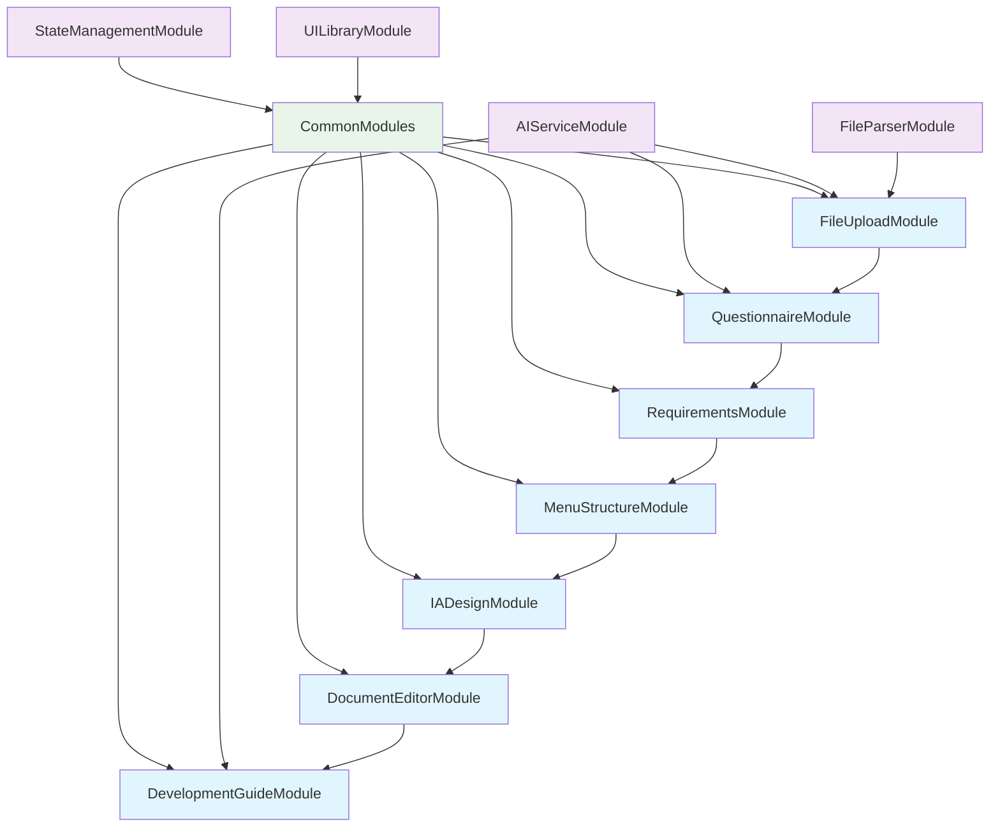

# SI Project Manager 플랫폼 모듈 설계 인덱스

## 📋 모듈 개요

SI Project Manager 플랫폼은 7단계 워크플로우 기반의 AI 자동화 시스템으로, 각 단계별로 독립적인 마이크로모듈로 설계되어 병렬 개발이 가능합니다.

## 🏗️ 모듈 구조도

```
SI Project Manager Platform
├── Frontend Modules (FE-M001 ~ FE-M008)
│   ├── FE-M001: FileUploadModule (파일 업로드 및 AI 분석)
│   ├── FE-M002: QuestionnaireModule (질의서 생성 및 편집)
│   ├── FE-M003: RequirementsModule (요구사항 정의서 관리)
│   ├── FE-M004: MenuStructureModule (메뉴구조도 설계)
│   ├── FE-M005: IADesignModule (IA 디자인 및 와이어프레임)
│   ├── FE-M006: DocumentEditorModule (개발 문서 편집)
│   ├── FE-M007: DevelopmentGuideModule (개발 가이드 생성)
│   └── FE-M008: CommonModules (공통 모듈들)
└── Shared Modules
    ├── SH-M001: AIServiceModule (AI 서비스 통합)
    ├── SH-M002: FileParserModule (파일 파싱 유틸리티)
    ├── SH-M003: StateManagementModule (전역 상태 관리)
    └── SH-M004: UILibraryModule (공통 UI 컴포넌트)
```

## 📊 모듈 의존성 관계



## 🎯 모듈별 우선순위 및 개발 일정

| 모듈 ID | 모듈명 | 우선순위 | 예상 개발 기간 | 담당 역할 | 의존성 |
|---------|--------|----------|---------------|-----------|--------|
| SH-M004 | UILibraryModule | P0 | 3일 | UI 개발자 | 없음 |
| SH-M003 | StateManagementModule | P0 | 2일 | 프론트엔드 아키텍트 | SH-M004 |
| SH-M002 | FileParserModule | P0 | 4일 | 백엔드 개발자 | 없음 |
| SH-M001 | AIServiceModule | P0 | 3일 | AI/백엔드 개발자 | SH-M002 |
| FE-M008 | CommonModules | P0 | 2일 | 프론트엔드 개발자 | SH-M004, SH-M003 |
| FE-M001 | FileUploadModule | P0 | 5일 | 프론트엔드 개발자 | SH-M001, SH-M002, FE-M008 |
| FE-M002 | QuestionnaireModule | P0 | 4일 | 프론트엔드 개발자 | SH-M001, FE-M008, FE-M001 |
| FE-M003 | RequirementsModule | P0 | 4일 | 프론트엔드 개발자 | FE-M008, FE-M002 |
| FE-M004 | MenuStructureModule | P0 | 3일 | 프론트엔드 개발자 | FE-M008, FE-M003 |
| FE-M005 | IADesignModule | P0 | 6일 | UI/UX 개발자 | FE-M008, FE-M004 |
| FE-M006 | DocumentEditorModule | P1 | 5일 | 프론트엔드 개발자 | FE-M008, FE-M005 |
| FE-M007 | DevelopmentGuideModule | P1 | 4일 | 프론트엔드 개발자 | SH-M001, FE-M008, FE-M006 |

## 📁 모듈별 상세 설계서

### Frontend Modules

1. **[FE-M001: FileUploadModule](./FE-M001-FileUploadModule.md)** - 파일 업로드 및 AI 분석
   - 드래그&드롭 파일 업로드
   - 다중 파일 형식 지원 (Excel, Word, PDF, 이미지, 텍스트)
   - AI 기반 문서 분석 및 결과 시각화

2. **[FE-M002: QuestionnaireModule](./FE-M002-QuestionnaireModule.md)** - 질의서 생성 및 편집
   - AI 자동 질문 생성
   - 실시간 편집 및 자동 저장
   - 완성도 검증 및 진행률 표시

3. **[FE-M003: RequirementsModule](./FE-M003-RequirementsModule.md)** - 요구사항 정의서 관리
   - 표준 템플릿 기반 요구사항 생성
   - 데이터 테이블 편집 및 관리
   - Excel import/export 기능

4. **[FE-M004: MenuStructureModule](./FE-M004-MenuStructureModule.md)** - 메뉴구조도 설계
   - 5단계 계층 구조 트리 뷰
   - 드래그&드롭 메뉴 재배치
   - 접근 권한 및 관리 기능 설정

5. **[FE-M005: IADesignModule](./FE-M005-IADesignModule.md)** - IA 디자인 및 와이어프레임
   - 드래그앤드롭 와이어프레임 빌더
   - 8개 카테고리 컴포넌트 라이브러리
   - IA Code 자동 생성 및 반응형 캔버스

6. **[FE-M006: DocumentEditorModule](./FE-M006-DocumentEditorModule.md)** - 개발 문서 편집
   - 5종 개발 문서 생성 및 편집
   - 마크다운/리치텍스트 에디터
   - 다이어그램 도구 및 PDF/Word export

7. **[FE-M007: DevelopmentGuideModule](./FE-M007-DevelopmentGuideModule.md)** - 개발 가이드 생성
   - 통합 문서 분석 및 개발 가이드 생성
   - 코드 템플릿 및 테스트 시나리오
   - Cursor IDE 연동 파일 생성

8. **[FE-M008: CommonModules](./FE-M008-CommonModules.md)** - 공통 모듈들
   - 진행 상태 추적 및 단계별 네비게이션
   - 자동 저장 및 데이터 내보내기
   - 공통 UI 컴포넌트 및 유틸리티

### Shared Modules

1. **[SH-M001: AIServiceModule](./SH-M001-AIServiceModule.md)** - AI 서비스 통합
   - OpenAI API 통합 및 관리
   - 파일 분석 및 요약 생성
   - 프로젝트 요약 및 질의서 생성

2. **[SH-M002: FileParserModule](./SH-M002-FileParserModule.md)** - 파일 파싱 유틸리티
   - 다중 파일 형식 파싱 (Excel, Word, PDF, 이미지, 텍스트)
   - 브라우저 호환 파싱 라이브러리
   - 메타데이터 추출 및 구조화

3. **[SH-M003: StateManagementModule](./SH-M003-StateManagementModule.md)** - 전역 상태 관리
   - Zustand 기반 상태 관리
   - 프로젝트 데이터 및 진행 상태 관리
   - 실시간 동기화 및 자동 저장

4. **[SH-M004: UILibraryModule](./SH-M004-UILibraryModule.md)** - 공통 UI 컴포넌트
   - Shadcn/ui + Tailwind CSS 기반
   - 재사용 가능한 컴포넌트 라이브러리
   - 테마 및 스타일 가이드

## 🔄 개발 워크플로우

### Phase 1: 기반 모듈 구축 (1주)
- SH-M004: UILibraryModule
- SH-M003: StateManagementModule
- SH-M002: FileParserModule
- SH-M001: AIServiceModule

### Phase 2: 공통 모듈 및 첫 번째 워크플로우 (1주)
- FE-M008: CommonModules
- FE-M001: FileUploadModule

### Phase 3: 핵심 워크플로우 모듈 (2주)
- FE-M002: QuestionnaireModule
- FE-M003: RequirementsModule
- FE-M004: MenuStructureModule

### Phase 4: 고급 기능 모듈 (2주)
- FE-M005: IADesignModule
- FE-M006: DocumentEditorModule
- FE-M007: DevelopmentGuideModule

### Phase 5: 통합 테스트 및 최적화 (1주)
- 모듈 간 통합 테스트
- 성능 최적화
- 사용자 테스트 및 피드백 반영

## 🧪 테스트 전략

### 단위 테스트
- 각 모듈별 독립적인 단위 테스트 (80% 커버리지 목표)
- Jest + Testing Library 활용

### 통합 테스트
- 모듈 간 인터페이스 테스트
- API 통합 테스트 (Supertest)

### E2E 테스트
- 전체 워크플로우 테스트 (Playwright)
- 핵심 사용자 시나리오 검증

## 📈 성능 목표

- **페이지 로딩**: 3초 이내
- **AI 분석**: 30초 이내 (파일당)
- **파일 업로드**: 10MB/초 이상
- **동시 사용자**: 100명 지원

## 🔒 보안 고려사항

- JWT 기반 토큰 인증
- 프로젝트별 접근 권한 관리
- 업로드 파일 암호화 저장
- HTTPS 통신 및 XSS/CSRF 보호

---

이 인덱스는 SI Project Manager 플랫폼의 모듈 설계 개요를 제공하며, 각 모듈의 상세 설계서는 별도 문서로 작성됩니다.
